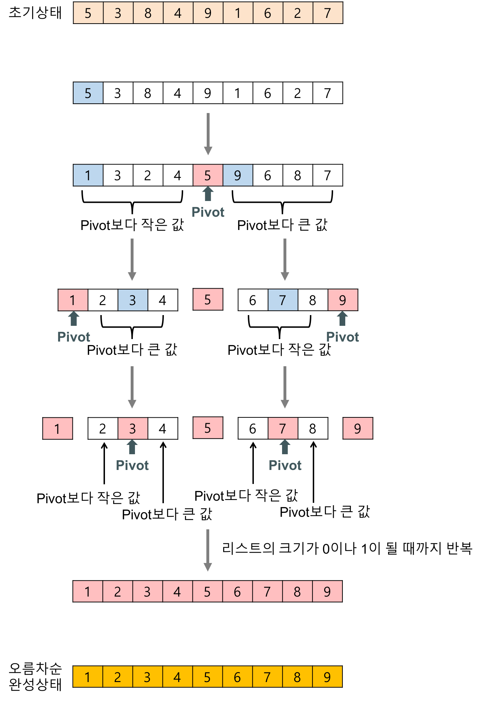

# 정렬 알고리즘

## 1. 거품 정렬 (Bubble Sort)

### 1.1 개념

- 서로 인접한 두 원소를 검사하여 정렬하는 알고리즘
  - 인접한 2개의 레코드를 비교하여 크기가 순서대로 되어 있지 않으면 서로 교환한다.

### 1.2 과정

- 버블 정렬은 첫 번째 자료와 두 번째 자료를, 두 번째 자료와 세 번째 자료를, ``` 마지막 자료까지 비교하여 교환하며 자료를 정렬한다.
- 1회전을 수행하고 나면 가장 큰 자료가 맨 뒤로 이동하므로 2회전에서는 맨 끝에 있는 자료는 정렬에 제외 되고 반복하여 정렬을 1회전 수행할 때마다 정렬에서 제외되는 데이터가 하나씩 늘어난다.

### 1.3 예제

- 배열 [7, 4, 5, 1, 3] 을 오름차순으로 정렬하기


### 1.4 코드 ( Python )

```python
arr = [7, 4, 5, 1, 3]
for i in range(len(arr)):
    for j in range(len(arr)-i-1):
        if arr[j] > arr[j+1]:
            arr[j], arr[j+1] = arr[j+1], arr[j]
         
for i in range(len(arr)-1,0,-1):
    for idx in range(i):
        if arr[idx] > arr[idx+1]:
            temp = arr[idx]
            arr[idx] = arr[idx+1]
            arr[idx+1] = temp
print(arr)
```


## 2. 선택 정렬 (selection sort)

### 2.1 개념

- Bubble Sort와 유사한 알고리즘으로, 해당 순서에 원소를 넣을 위치는 이미 정해져 있고, 어떤 원소를 넣을지 선택하는 알고리즘이다. 

### 2.2 과정

- 주어진 배열 중에서 최솟값 찾기

- 그 값을 맨 앞에 위치한 값과 교체
- 맨 처음 위치를 뺀 나머지 리스트를 같은 방법으로 교체
- 하나의 원소만 남을 때까지 위의 과정 반복

### 2.3 예제

- 배열 [9, 6, 7, 3, 5] 오름차순으로 정렬하기


### 2.4 코드 ( Python )

```python
arr = [9, 6, 7, 3, 5]
for i in range(len(arr)):
    idx = i
    for j in range(i+1,len(arr)):
        if arr[idx] > arr[j]:
            idx = j 
    arr[i], arr[idx] = arr[idx], arr[i]
print(arr)
```


## 3. 삽입 정렬 (Insertion sort)

### 3.1 개념

- 손안의 카드를 정렬하는 방법과 유사하다.
  - 새로운 카드를 기존의 정렬된 카드 사이의 올바른 자리를 찾아 삽입한다.
  - 새로 삽입될 카드의 수만큼 반복하게 되면 전체 카드가 정렬된다.
- 자료 배열의 모든 요소를 앞에서부터 차례댈 이미 정렬된 배열 부분과 비교 하여, 자신의 위치를 찾아 삽입함으로써 정렬을 완성하는 알고리즘
- 매 순서마다 해당 원소를 삽입할 수 있는 위치를 찾아 해당 위치에 넣는다.

### 3.2 과정

- 정렬은 2번째 위치(index) 의 값을 temp에 저장한다.
- temp와 이전에 있는 원소들과 비교하여 삽입해나간다.
- 1번으로 돌아가 다음 위치(index) 의 값을 temp에 저장하고 반복한다.

### 3.3 예제

- 배열 [8, 5, 6, 2, 4] 오름차순으로 정렬


### 3.4 코드 ( Python )

```python
arr = [8, 5, 6, 2, 4]
for i in range(1,len(arr)):
    temp = arr[i]
    for j in range(i,0,-1):
        if arr[j-1] > arr[j]:
            arr[j-1], arr[j] = arr[j], arr[j-1]
print(arr)
```


## 4. 퀵 정렬( Quick Sort )

### 4.1 개념

- 퀵 정렬은 **불안정 정렬**에 속하며, 다른 원소와의 비교만으로 정렬을 수행하는 **비교 정렬**에 속한다.
- 분할 정복 알고리즘의 하나로, 평균적으로 **매우 빠른 수행 속도를**자랑하는 정렬 방법
  - 합병 정렬(merge sort)과 달리 퀵 정렬은 리스트를 비균등하게 분할한다.

### 4.2 과정

- 리스트 안에 있는 한 요소를 선택한다. 이렇게 고른 원소를 피벗(pivot)이라고 한다.
- [분할] 피벗을 기준으로 피벗보다 작은 요소들은 모두 피벗의 왼쪽으로 옮겨지고 피벗보다 큰 요소들은 모두 피벗의 오른쪽으로 옮겨진다. (피벗을 중심으로 왼쪽: 피벗보다 작은 요소들, 오른쪽: 피벗보다 큰 요소들)
- [정복] 피벗을 제외한 왼쪽 리스트와 오른쪽 리스트를 다시 정렬한다.
  - 분할된 부분 리스트에 대하여 순환 호출을 이용하여 정렬을 반복한다.
  - 부분 리스트에서도 다시 피벗을 정하고 피벗을 기준으로 2개의 부분 리스트로 나누는 과정을 반복한다.
- 부분 리스트들이 더 이상 분할이 불가능할 때까지 반복한다. (리스트의 크기가 0 또는 1이 될때까지 반복)




### 4.3 예제

- 배열 [5, 3, 8, 4, 9, 1, 6, 2, 7] 오름차순으로 정렬


### 4.4 코드

```python
arr = [5, 3, 8, 4, 9, 1, 6, 2, 7]
def quick_sort(arr,start,end):
    if start >= end:
        return 
    pivot = start
    left = start + 1
    right = end
    while left <= right:
        # 피벗보다 큰 데이터를 찾을 때까지 반복
        while left <= end and arr[left] <= arr[pivot]:
            left += 1
        # 피벗보다 작은 데이터를 찾을 때까지 반복
        while start < right and arr[right] >= arr[pivot]:
            right -= 1
        # 엇갈리는 순간에 교체
        if left > right:
            arr[right], arr[pivot] = arr[pivot], arr[right]
        else:
            arr[left], arr[right] = arr[right], arr[left]
    # 분할 이후 왼쪽 오른쪽 각각 정렬 수행
    quick_sort(arr,start,right-1)
    quick_sort(arr,right+1,end)
quick_sort(arr,0,len(arr)-1)
print(arr)
```


## 5. 합병 정렬( merge sort )

### 5.1 개념

- 일반적으로 방법을 구현했을 때 이 정렬은 **안정 정렬**에 속하며, 분할 정복 알고리즘의 하나이다. 
  - 분할 정복(divide and conquer) 방법
    - 문제를 작은 2개의 문제로 분리하고 각각을 해결한 다음, 결과를 모아서 원래의 문제를 해결하는 전략이다.
    - 분할 정복 방법은 대개 순환 호출을 이용하여 구현한다.
- 하나의 리스트를 두 개의 균등한 크기로 분할하고 분할된 부분 리스트를 정렬한 다음, 두개의 정렬 된 부분 리스틀르 합하여 전체가 정렬된 리스트가 되게 하는 방법이다.

### 5.2 과정

- 리스트의 길이가 0 또는 1이면 이미 정렬된 것으로 본다. 
- 그렇지 않은 경우 정렬되지 않은 리스트를 절반으로 잘라 비슷한 크기의 두 부분 리스트로 나눈다.
- 각 부분 리스트를 재귀적으로 합병 정렬을 이용해 정렬한다.
- 두 부분 리스트를 다시 하나의 정렬된 리스트로 합병한다.
- [분할 Divide] : 입력 배열을 같은 크기의 2개의 부분 배열로 분할
- [정복 Conquer] : 부분 배열 정렬, 부분 배열의 크기가 충분히 작지 않으면 순환 호출을 이용하여 다시 분할 정복 방법으로 적용
- [결합 Combine] : 정렬된 부분 배열들을 하나의 배열에 합병한다.


### 5.3 예제

- 배열 [27, 10, 12, 20, 15, 13, 15, 22] 오름차순으로 정렬하기

  

  

### 5.4 코드

```python
arr = [27, 10, 12, 20, 15, 13, 15, 22]
def merge_sort(arr):
    if len(arr) <= 1:
        return arr
    mid = len(arr) // 2
    left = arr[:mid]
    right = arr[mid:]
    merge_sort(left)
    merge_sort(right)
    # 병합
    i, j, k = 0, 0, 0
    while i < len(left) and j < len(right):
        if left[i] < right[j]:
            arr[k] = left[i]
            i += 1
            k += 1
        else:
            arr[k] = right[j]
            j += 1
            k += 1
    # 아직 남아 있는 자료들 결과에 추가
    while i < len(left):
        arr[k] = left[i]
        i += 1
        k += 1
    while j < len(right):
        arr[k] = right[j]
        j += 1
        k += 1
merge_sort(arr)
print(arr)
    
    
```


## 6. 힙 정렬 ( heap sort )

### 6.1 개념

- 최대 힙 트리나 최소 힙 트리를 구성해 정렬을 하는 방법
- 내림차순 정렬 => 최대 힙, 오른차순 정렬 => 최소 힙을 구성하면 된다.

### 6.2 과정

- 정렬해야 할 n개의 요소들로 최대 힙(완전 이진 트리 형태)를 만든다.
- 한 번에 하나씩 요소를 힙에서 꺼내서 배열의 뒤부터 저장
- 삭제되는 요소들(최대값부터 삭제)은 값이 감소되는 순서로 정렬되게 된다.(내림차순)

### 6.3 예제

#### 내림차순 정렬을 위해 최대 힙의 구현

- 힙은 1차원 배열로 쉽게 구현될 수 있다.
- 정렬해야 할 n개의 요소들을 1차원 배열에 기억한 후 최대 힙 삽입을 통해 차례대로 삽입한다.
- 최대 힙으로 구성된 배열에서 최대값부터 삭제한다.

1. ##### 최대 힙 삽입

   - 힙에 새로운 요소가 들어오면, 힙의 마지막 노드에 삽입한다.
   - 새로운 노드를 부모 노드들과 교환해서 힙의 성질을 만족시킨다.

   

2. ##### 최대 힙 삭제

   - 최대 힙에서 최대값은 루트 노드이므로 루트 노드가 삭제된다.
   - 삭제된 루트 노드에는 힙의 마지막 노드를 가져온다.
   - 힙을 재구성한다.

   


### 6.4 코드

```python
arr = [9, 7, 6, 5, 4, 3, 2, 2, 1, 3]
def heapify():
    for i in range(1,len(arr)):
        c = i
        while c > 0:
            root = (c-1) // 2
            if arr[c] > arr[root]:
                arr[c], arr[root] = arr[root], arr[c]
            c = root
    return
def heap_right():
    for i in range(len(arr)-1,-1,-1):
        # 맨 앞과 맨 뒤를 비교, 가장 큰 수를 뒤로 가장 큰 수는 fix
        arr[0], arr[i] = arr[i], arr[0]
        # 다시 힙구조로 바꾸기
        root, c = 0, 1
        while c < i:
            c = root * 2 + 1
            if c < i-1 and arr[c] < arr[c + 1]:
                c += 1
            if c < i and arr[c] > arr[root]:
                arr[c], arr[root] = arr[root], arr[c]
            root = c
    return
heapify()
print(arr)
heap_right()
print(arr)
```


[참고]  

- https://gmlwjd9405.github.io/2018/05/06/algorithm-bubble-sort.html
- https://gmlwjd9405.github.io/2018/05/06/algorithm-selection-sort.html
- https://gmlwjd9405.github.io/2018/05/06/algorithm-insertion-sort.html
- https://gmlwjd9405.github.io/2018/05/10/algorithm-quick-sort.html
- https://gmlwjd9405.github.io/2018/05/08/algorithm-merge-sort.html
- https://gmlwjd9405.github.io/2018/05/10/algorithm-heap-sort.html
- https://ratsgo.github.io/data%20structure&algorithm/2017/09/27/heapsort/