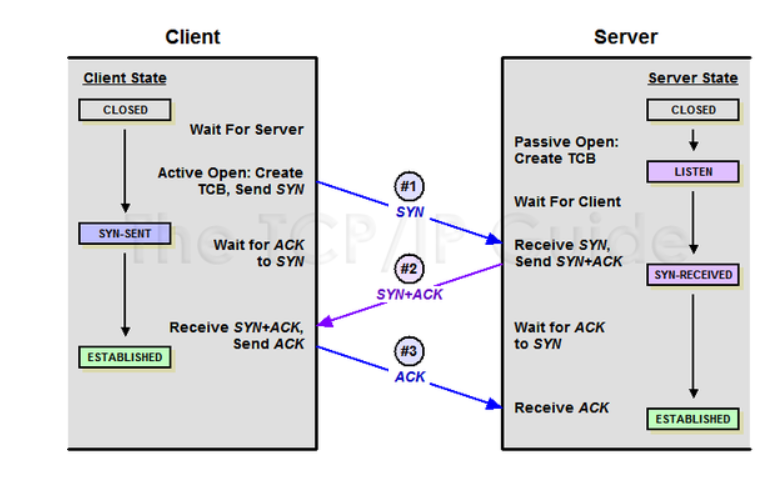
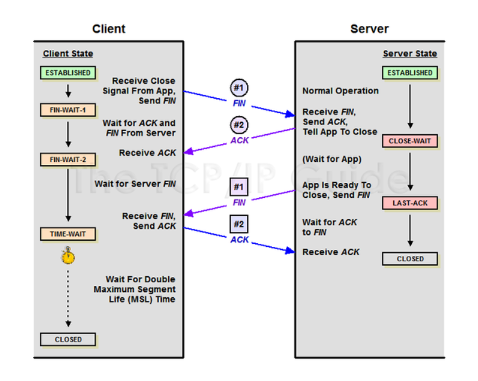

#### 네트워크 

##### 3 Way-HandShake & 4 Way-HandShake

### :checkered_flag:<b>3 Way HandShake</b>

- 3 Way HandShake란 TCP/IP 프로토콜을 이용해서 통신을 하는 응용프로그램이 데이터를 전송하기전에 정확한 전송을 보장하기 위해 상대방의 컴퓨터와 사전에 세션을 먼저 수립하는 과정
- 양쪽 모두 데이터를 전송할 준비가 되었다는 것을 보장하고, 실제로 데이터 전달이 시작하기 전에 서로 준비되었다는 점을 알려준다.
- <b>양쪽 모두 상대편에 대한 초기 순차일련번호를 얻을 수 있도록 한다.</b>
- <b>요약 : 다른 컴퓨터랑 통신하기 전에 정확하게 하기위해 미리 설정하는 과정</b> 

1.  <b>Client > Server : SYN</b>
2.  <b>Server>Client : SYN , ACK</b>

3.  <b>Client > Server : ACK</b>

##### :pencil2: <b>SYN : `synchronize sequence numbers`</b>

##### :pencil2: <b>ACK : `acknowldegment`</b>

#### [STEP 1]

- A 클라이언트는 B서버에 접속을 요청하는 SYN 패킷을 보낸다. 이때 A클라이언트는 SYN을 보내고 SYN/ACK 응답을 기다리는 SYN_SENT 상태가 된다

#### [STEP 2]

- B서버는 SYN요청을 받고 A클라이언트에게 요청을 수락한다는 ACK와 SYN flag가 설정된 패킷을 발송하고 A가 다시 ACK으로 응답하기를 기다린다. 이때 B서버는 STN_RECEIVED 상태가 된다.

#### [STEP 3]

- A클라이언트는 B서버에게 ACK를 보내고 이후로부터는 연결이 이루어지고 데이터가 오가게 되는것이다. 이때 B서버 상태가 ESTABLISHED 이다. 위와 같은 방식으로 통신하는 것이 신뢰성 있는 연결을 맺어 준다는 TCP의 3Way handshake 방식이다.

### :checkered_flag:<b> 4 Way HandShake</b>

- <b>4 Way HandShake는 세션을 종료하기 위해 수행되는 절차이다.</b>

  

#### [STEP 1]

- 클라이언트가 연결을 종료하겠다는 FIN 플래그를 전송한다.

#### [STEP 2]

- 서버는 일단 확인 메시지를 보내고 자신의 통신이 끝날때까지 기다리는데 이 상태가 TIME_WAIT상태이다.

#### [STEP 3]

- 서버가 통신이 끝났으면 연결이 종료되었다고 클라이언트에게 FIN 플래그를 보낸다.

#### [STEP 4]

- 클라이언트는 확인했다는 메시지를 보낸다

그런데 만약 <b>Server</b>에서 FIN을 전송하기 전에 전송한 패킷이 Routing 지연이나 패킷 유실로 인한 재전송 등으로 인해 FIN패킷 보다 늦게 도착하는 상황이 발생할 수도 있다.

이를 해결하기 위해 <b>Client</b>에서 <b>Server</b>로부터 FIN을 받은 후 일정 시간동안 세션을 남겨놓고 잉여 패킷을 기다리는 과정을 거친다. (디폴트 : 240초)

<b>osi 계층 및 tcp/ip 관련 추가 공부</b>

참조 래퍼런스 

https://mindnet.tistory.com/entry/%EB%84%A4%ED%8A%B8%EC%9B%8C%ED%81%AC-%EC%89%BD%EA%B2%8C-%EC%9D%B4%ED%95%B4%ED%95%98%EA%B8%B0-22%ED%8E%B8-TCP-3-WayHandshake-4-WayHandshake

https://sleepyeyes.tistory.com/4