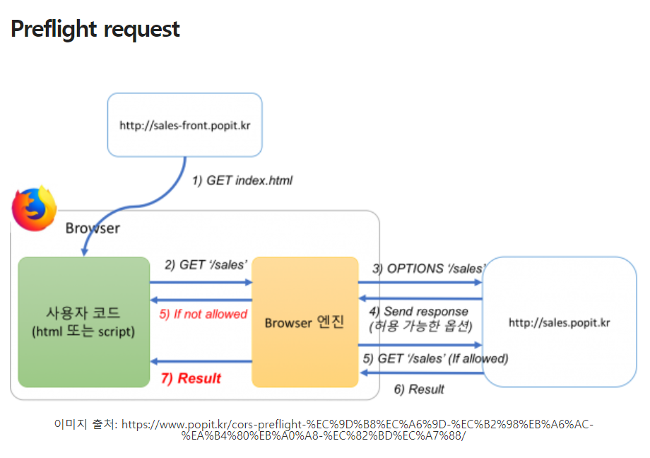

###  :black_flag: Cors란 무엇인가?

##### Cross-Origin Resource Sharing(CORS)은 추가적인 HTTP header를 사용해서 애플리케이션이 다른 Origin의 리소스에 접근할 수 있도록 하는 매커니즘을 말함. 하지만 다른 Origin에서 내 리소스에는 함부로 접근하지 못하게 하기 위함

-즉 `header를 통해 나는 다른 origin에 접근하지만 다른 애들은 나에게 접근하지 못하도록 혹시 나에게 접근하려면 내가 인증한 header를 가져와라!!`

##### 요청 헤더 목록

- Origin

- Access-Control-Request-Method
  
  - `preflight`요청을 할 때 실제 요청에서 어떤 메서드를 사용할 것인지 서버에 알리기 위해 사용됨
  
- Access-Control-Request-Headers
  
  - `preflight`요청을 할 때 실제 요청에서 어떤 header를 사용할 것인지 서버에 알리기 위해 사용됨
  
- `preflight request` : actual 요청 전에 인증헤더를 전송하여 서버의 허용 여부를 하는 테스트 요청

  

##### 응답 헤더 목록

- Access-Control-Allow-Origin
  - 브라우저가 해당 origin이 자원에 접근할 수 있도록 허용함
  - `*`의 경우 credentials이 없는 요청에 한해서 모든 origin이 접근가능하도록 해줌
- Access-Control-Expose-Header
  - 브라우저가 액세스할 수 있는 서버 화이트 리스트 헤더를 허용함
- Access-Control-Max-Age
  - 얼마나 오랫동안 `preflight`요청이 캐싱 될 수 있는지를 나타냄
- Access-Control-Allow-Credentials
  - `Credeintials`가 True일때 요청에 대한 응답이 노출될 수 있는지를 나타냄
  - `preflight`요청에 대한 응답의 일부로 사용되는 경우 실제 자격 증명을 사용하여 실제 요청을 수행 할 수 있는지를 나타냄
  - 간단한 GET요청은 `preflight`되지 않으므로 자격 증명이 있는 리소스를 요청하면 헤더가 리소스와 함께 반환되지 않으면 브라우저에서 응답을 무시하고 웹 콘텐츠로 반환하지 않는다.
- Access-Control-Allow-Methods
  - `preflight`요청에 대한 응답으로 허용되는 메서드를 나타냄
- Access-Control-Allow-Headers
  - `preflight`요청에 대한 응답으로 실제 요청시 사용할 수 있는 HTTP 헤더를 나타냄

### Simple Request

- CORS Preflight Request을 발생시키지 않음, 하지만 당연히 simple request도 POST의 경우에는 access-control-allow-origin에는 등록 되어 있어야함
- 1. GET / HEAD / POST 중 한 가지 메소드를 사용해야함
  2. 오직 아래 세개의 Content Type만 지정해야함
     - application / x-www-form-urlencoded
     - multipart/form-data
     - text/plain

### CORS는 왜 필요한가?

- 기본적으로 브라우저는 Same-Origin-Policy(동일 출처 정책)을 따른다.
- 하지만 웹 애플리케이션을 구현하다보면 다른 출처에 있는 리소스를 요청하는 경우가 많음
- SPA로 구현된 웹 애플리케이션의 경우 다른 도메인을 가진 API서버에 요청하는 경우가 매우 많음
- cross-origin 요청이 필요한 경우가 많아지고 있기 때문에 이를 안전하게 처리하기 위해 cors가 등장했다. 
- CORS는 cross-origin 요청을 제한적으로 허용함으로써 좀 더 안전하게 cross-origin 요청을 처리할 수 있게 해주는 정책
- `Origin이란 URL의 protocol , domain, port가 모두 같음을 의미함`

- `동일 출처 정책`
  - 특정 출처에서 불러온 문서나 스크립트가 다른 출처에서 가져온 리소스와 상호작용하는 것을 제한하는 중요한 보안 방식, 동일 출처 정책은 잠재적으로 해로울 수 있는 문서를 분리함으로써 공격받을 수 있는 경로를 줄여준다.

래퍼런스

https://hannut91.github.io/blogs/infra/cors

https://im-developer.tistory.com/165

https://developer.mozilla.org/ko/docs/Web/Security/Same-origin_policy

http://wiki.gurubee.net/display/SWDEV/CORS+%28Cross-Origin+Resource+Sharing%29

https://nhj12311.tistory.com/69