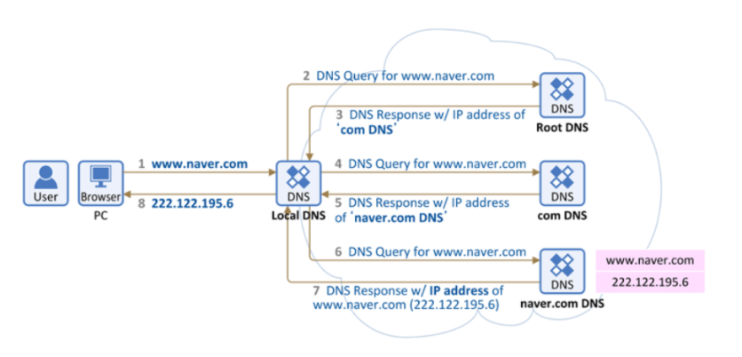

### DNS

#### DNS란 무엇인가?

- DNS라고 하면 TCP/IP 네트워크 상에서 사람이 기억하기 쉽게 문자로 만들어진 도메인을 컴퓨터가 처리할 수 있는 숫자로 된 IP주소로 바꾸는 시스템 및 서버를 일컬음
- 요약 : www.naver.com으로 사람들은 기억하지만 컴퓨터는 naver를 125.209.222.141로 처리함
- 사람들이 125.209.222.141로 기억하기는 쉽지 않으니 naver라는 도메인명으로 기억시키고 이를 dns서버가 IP주소로 변경시킴

#### DNS의 작동 흐름과정에 대해 설명하시오.

1. 웹 브라우저에 www.naver.com을 입력할 경우 먼저 Local DNS에 www.naver.com이라는 hostnamme에 대응하면 IP주소를 질의한 후 Local DNS에 있을 경우 IP주소를 전달 받음, 없을 경우 Root DNS에 대한 정보를 전달 받음

`Root Dns`: 인터넷 도메인 네임 시스템의 루트존이다. 루트 존은 레코드의 요청에 직접 응답하고 적절한 최상위 도메인에 대해 권한이 있는 네임 서버 목록을 반환한다, 전세계에는 961개의 루트 DNS가 존재한다.

2. Root DNS에 www.naver.com에 대한 ip주소를 질의한다.
3. Root DNS 서버로부터 com 도메인을 관리하는 TLD(Top-Level Domain)이름 서버 정보를 받음 (여기서 TLD는 com 도메인을 관리하는 서버를 지칭함)
4. TLD에 www.naver.com 질의
5. TLD에서 "name.com"을 관리하는 DNS에 정보 전달
6. naver.com 도메인을 관리하는 DNS서버에 www.naver.com 호스트 네임에 대한 IP주소 질의
7. Local DNS 서버에게 www.naver.com의 IP주소 응답
8. Local DNS는 www.naver.com에 대한 IP주소를 캐싱하고 IP주소 전달

참조 래퍼런스

https://samsikworld.tistory.com/489

https://velog.io/@goban/DNS%EC%99%80-%EC%9E%91%EB%8F%99%EC%9B%90%EB%A6%AC

