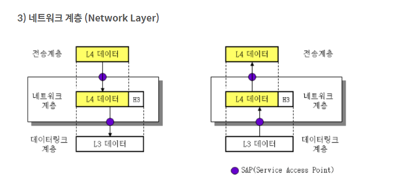
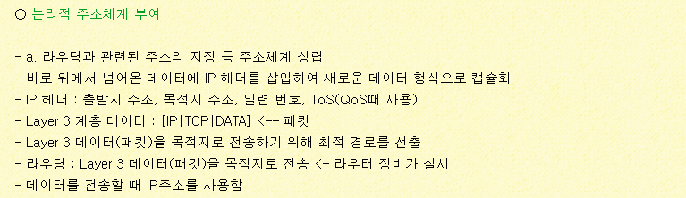
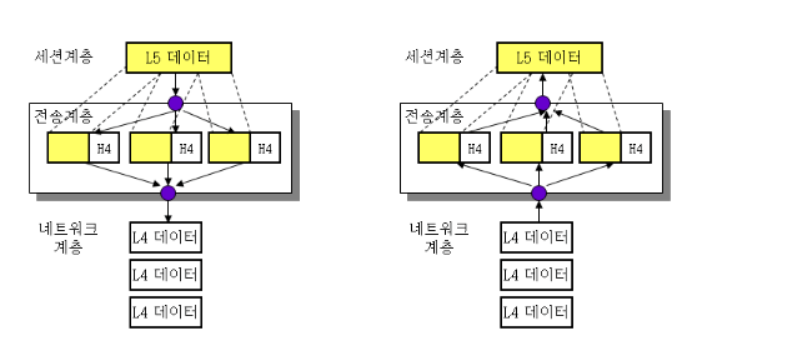
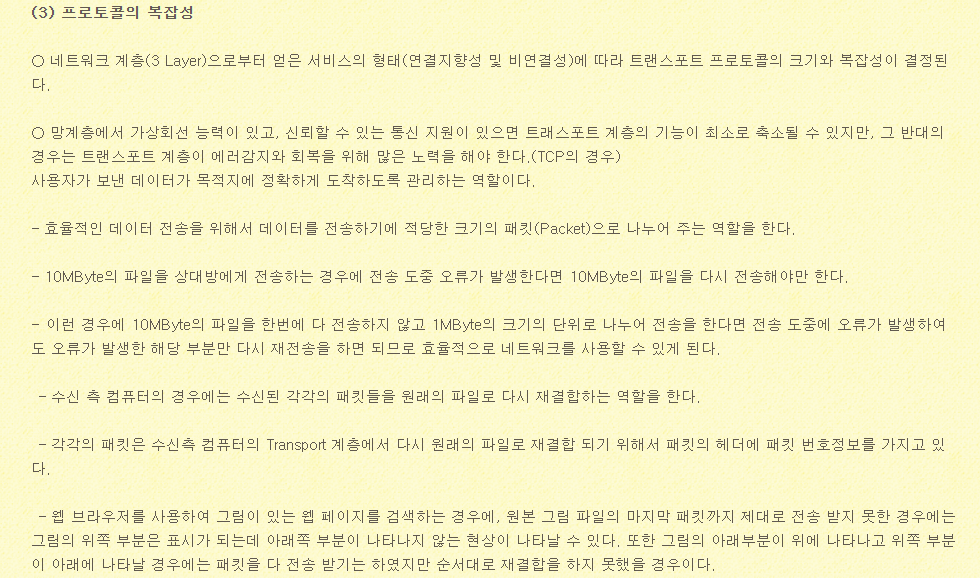

### OSI 7계층 정리

##### :checkered_flag: OSI 7계층이란?

<b>OSI7계층이란 모든 네트워크 통신에서 생기는 여러 충돌 문제를 완화하기 위해, 국제 표준 기구 (iso)에서 네트워크를 7단계로 나눈 표준기준을 말한다.</b>

- 7계층으로 나누면서 서로 통신하며 일어나는 과정들을 세분화하기 쉽고 이를 통해 소통이 간편해진다.

`pc방에서 롤을 하는데 연결이 끊겼을 경우, 모든 컴퓨터에서 문제가 발생했을 경우 네트워크 계층 혹은 물리계층의 문제를 의미한다. 그러나 한 컴퓨터에만 문제가 발생할 경우 응용계층 혹은 데이터 링크 계층에 문제가 발생했음을 의미한다.`

### :pencil2: 1. 물리계층

- 물리계층은 주로 기계,전기적 특성을 이용해 통신 테이블로 데이터를 전송한다.
- 통신 단위는 <b>비트</b>가 사용된다.
- 데이터의 전달에 있어서 데이터의 종류나 문제여부는 신경쓰기 않고 오직 송-수신만을 담당한다.
- 대표적인 기기 : 리피터 , 허브
- 

### :pencil2:2. 데이터 링크 계층

- 데이터 링크계층은 물리계층을 통해 송-수신되는 정보의 오류와 흐름을 관리하여 안전한 정보의 전달을 수행할 수 있도록 재전송 역할을 한다.
- 데이터 링크층은 점대점(Point to Point) 간 신뢰가 있는 전송을 보장하기 위한 계층이기에 순환 중복 검사(CRC) 기반의 오류 및 흐름 제어(기능적, 절차적 수단 제공)가 필요하다.
- 전송되는 단위를 '프레임'이라 하고, 대표적인 장비로 브리지와 스위치 등이 있다
- 데이터 링크층은 맥(MAC) 주소를 사용하여 통신한다.
- 이 계층은 두 개의 하위 계층으로도 나뉘는데 MAC과 LLC이다. MAC은 맥 주소를 이용해서 데이터를 해당 장비로 보내는 것이고, LLC는 각 장비를 논리적으로 연결하고 유지하는 역할을 한다

- 프로토콜은 HDLC, PPP, Frame-Relay, FDDI, ATM 등이 있다.

- 흐름제어 : 보내는 측과 받는 측간의 속도차이를 보상하는데 필수적인 기능
- 에러제어 : 물리전송과정을 통해 오류와 잡음이 섞여있을 수 있는데 이를 수정함
  - 정확하게 수신되지 않은 패킷들을 ack와 함께 송신자에게 재전송한다.
  - 비동기 통신에서는 에러 검출만을 제공하지만 동기통신에서는 에러 검출 및 수정 기능 모두가 제공된다.
- 순서제어 : 패킷이나 ack신호를 혼동할 수 있기 때문에 ack에는 일련번호를 붙힌다.
- 전송단위는 프레임이다.
- 프레이밍 : 데이터를 프레임으로 그룹화하여 전송한다. 물리계층에서 받은 비트를 패킷화한 링크로 변환한다. 이후 이를 전송단위의 패킷(프레임)으로 바꾸어 그룹화함

<b> 궁극적으로 데이터 링크 프로토콜은 인접하게 접속된 기기 사이의 통신을 관리하고 , 신뢰도를 높이는데 주로 사용된다 : 대표적인 프로토콜은 이더넷이 존재한다.</b>

- 브리치 : 
- 스위치 :

### :pencil2: 3. 네트워크 계층

- 네트워크층의 가장 중요한 역할은 패킷을 목적지로 빠르게 전송하는 역할이다.
- 네트워크 층의 스위칭과 라우팅이라는 역할을 한다.
- 네트워크 층에서는 문제의 여부와 상관없이 데이터를 보내는 일에 중점을 둔다.
- 논리적인 주소 구조를 갖는다.
- 전송단위는 패킷이다
- 대표적인 프로토콜은 IP를 예로 들 수 있다.

- 전송계층에서 만들어진 패킷을 전달받아 목적지 컴퓨터의 논리적인 주소를 네트워크 계층의 헤더에 추가한다.
- 라우팅 : 단말기 혹은 컴퓨터가 어떤 망에 접속되었을 시 송신하고자 하는 정보가 망을 통해서 어떻게 상대방 수신측 까지 전달되는가를 제어하는 일을 담당 : 하나 이상의 복수 통신만을 통한 중계를 하며 , 개방 시스템간의 데이터를 전송
- 투명성 : 전송계층이 경로선택등의 과정에 대해 신경 안써줘도 되도록 돕는 역할
- 전송단위 : 데이터그램 , 패킷

### :pencil2:4. 전송계층

- 통신을 활성화하기 위한 계층으로 보낼 데이터의 용량과 속도, 목적지 등을 처리하며 전체 메세지가 완전히 옳게 도착하는 것을 보장하는 것을 담당한다.
- 대표적인 프로토콜로 TCP , UDP가 존재함
- 전송단위 : 세그먼트

- 개요 : 전송계층은 어떤 종류의 네트워크가 사용되었는지를 이용자가 의식하지 않도록 쌍방 이용자(응용 프로세스)간 투명하고 신뢰성있게 양단 간에 논리적 통신을 가능하게 해주는 계층
- 가장 핵심적인 계층이며 가장 복잡한 계층이다.
- 네트워크가 아닌 호스트 내에 구동된 프로세스 사이의 연결 확립
  - 전송계층은 정보전달을 주로 두 호스트 보다는 두 프로세스간의 통신으로 바꾸어 준다.
  - 즉 양 호스트간의 응용프로세스 통신을 지원한다.
- 두 종단 프로세스 간에 성립된 세션제어
  - 세션을 갖고 있는 두 이용자 사이의 전송을 위한 종단간 제어
- 신뢰적 전송 
  - 어떤 망에 어떻게 연결되어있든 상대 단말기에 정보를 틀림없이 전송
- 투명한 전송
  - 경로 선택이나 중계기능에 관여하지 않는다.
- 논리 회선 및 다중화/역다중화를 지원해준다.
  - 다중화 : 동시에 여러개의 논리적 연결을 가능하게 해주는 역할

### :pencil2: 5. 세션 계층

- 데이터가 통신하기 위한 논리적인 연결 즉 통신을 책임지는 계층
- 응용 프로그램간의 연결을 성립 시키고 연결이 안정되게 유지되도록 관리하며, 작업이 끝날 경우 연결을 끊는 역할을 한다.
- 또한 연결 세션에서 데이터 교환의 에러가 발생시 복구를 한다.
- 주요 기능
  - 접속 및 접속 해제
    - 세션을 설정한다. 여러 세션들이 효율을 높이기 위해 같은 트랜스포트 접속을 사용할 수 있다. 반대의 경우도 가능하다. 전송계층과 마찬가지로 세션계층에서도 다중화가 가능하다.
- 데이터 교환
  - 데이터를 4가지 등급으로 구분한다. 
    - 정보데이터
    - 급송데이터
    - 제어데이터
    - 세션데이터 
- 세션계층을 토큰을 활용해 대화한다.
- 에러복구
  - 세션 계층은 전송 시 동기점을 삽입함으로써 메시지를 대화단위로 그룹화 한다.
  - 에러에 의해 대화가 중단되었을 경우 동기점을 기준으로 다시 시작된다.

### :pencil2: 6. 표현계층

- 표현계층은 데이터의 포맷을 정의하여 서로 다른 응용프로그램들이 데이터를 서로 이해하도록 도와준다.
- 데이터의 디코딩 및 인코딩을 담당한다.
- 암호화 , 압축 ,코드변환 등

### :pencil2: 7. 응용계층 

- OSI 7계층 중 최상위 계층으로 사용자가 직접 눈으로 확인하는 계층
- 응용프로그램들이 동작하는 계층

래퍼런스

https://malgun-gothic.tistory.com/3

https://beankhan.tistory.com/68

https://mintnlatte.tistory.com/63

https://mintnlatte.tistory.com/62?category=407845

https://mintnlatte.tistory.com/60?category=407845

https://usage.tistory.com/62