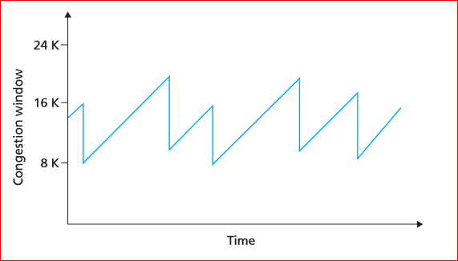

# TCP/IP

### 1. TCP/IP 정의

- Internet Protocol Suite 는 인터넷에서 컴퓨터들이 서로 정보를 주고받는데 쓰이는 통신규약(프로토콜)의 모음이다. 인터넷 프로토콜 슈트 중 TCP와 IP가 가장 많이 쓰이기 때문에 TCP/IP 프로토콜 슈트라고도 불린다.

- TCP/IP : IP(패팃 통신 방식의 인터넷 프로토콜) + TCP(전송 제어 프로토콜)

- IP는 패킷 전달 여부를 보증하지 않고, 패킷을 보낸 순서와 받는 순서가 다를 수 있다. 

- TCP는 IP위에서 동작하는 프로토콜로, 데이터의 전달을 보증하고 보낸 순서대로 받게 해 준다. 

- TCP/IP를 사용하겠다는 것은 IP주소 체계를 따르며 TCP의 특성을 활용해 송신자와 수신자의 논리적 연결을 생성하고 신뢰성을 유지할 수 있도록 하겠다는 것을 의미한다.

- 즉, TCP/IP는 송신자가 수신자에게 IP주소를 사용하여 데이터를 전달하고 그 데이터가 제대로 갔는지, 너무 빠르지는 않는지, 제대로 받았다고 연락은 오는지에 대한 내용.

- TPC/IP는 OSI 7계층 중 네트워트 계층(3 Layer), 전송 계층(4 Layer)을 다루는 프로토콜이다. 

### 2. TCP의 개요

- 전송 제어 프로토콜(Transmission Control Protocol, TCP)은 인터넷 프로토콜 스위트(IP)의 핵심 프로토콜 중 하나로, IP와 함께 TCP/IP라는 명칭으로 불린다. 
- 전송계층에 위치한다. 네트워크 정보 전달을 통제하는 프로토콜이자 인터넷을 이루는 핵심 프로토콜 중 하나이다. 

### 3. TCP의 작동(3-way handshake)

- TCP를 사용하는 송신자와 수신자는 데이터를 전송하기 전 먼서 서로 통신이 가능한지 의사를 묻고 한 번에 얼마나 받을 수 있는지 등의 정보를 확인한다.
- 이는 신뢰성 있는 통신과 데이터를 안전하고 빠지는 부분 없이 보내기 위함이다.

- TCP로 이루어지는 모든 통신은 반드시 3-way handshake를 통해 시작한다.

### 4. TCP의 특징

#### 4.1 흐름 제어

- 송신자는 자신이 한번에 얼마나 보낼 수 있는지, 수신자는 자신이 데이터를 어디까지 받았는지 끊임없이 확인하고 TCP Header내의 'Window size'를 사용해 한번에 받고/보낼 수 있는 데이터의 양을 정한다.
- 수신자가 3-way handshake 때 Window size(일정량의 데이터)를 정한다. 

- Acknowledgment Number : 자신이 지금까지 받은 데이터 양을 확인하여 송신자에게 보내는 것
- 만약 수신자가 300번재 데이터를 받았으면 Acknowledgment Number 에 1을 추가하여 301을 보낸다. 
- 300번까지 받았으니 301번부터 보내지 말라는 뜻이다. 
- Sequnce Number : 데이터의 순서 번호를 표기한 것

#### 4.2.1혼잡 제어

- 네트워크의 혼잡 상태를 파악하고 그 상태를 해결하기 위해 데이터 전송을 제어하는 것
- 네트워크의 혼잡 상태가 감지되면, 혼잡 붕괴(여기저기서 재전송이 반복되는 것)라는 최악의 상황을 최대한 회피하기 위해 송신 측의 윈도우 크기를 조절하여 데이터의 전송량을 강제적으로 줄이는 것이 혼잡제어이다. 

#### 4.2.2 혼잡제어 해결방법

1. ##### AIMD(Additive Increase / Multiplicative Decrease)

   - 합 증가 / 곱 감소 방식이라는 뜻이다.

   - 즉, 네트워크에 문제가 없는 경우 전송 속도를 빠르게 할때 혼잡 윈도우 크기를 1씩 증가, 중간에 데이터가 유실되거나 응답이 오지 않는 등의 혼잡 상태가 감지되면 혼잡 윈도우 크기를 반으로 줄인다.

   - 늘어날 때는 `ws+1` , 줄어들 때는 `ws*0.5` 이다.

     

   - 시간이 갈수록 네트워크에 참여한 순서와 관계 없이 모든 호스트들의 윈도우 크기가 평행 상태로 수렴한다. 

     - 네트워크에 일찍 참여해서 이미 혼잡 윈도우 크기가 큰 놈은 자신의 윈도우 크기를 줄여서 혼잡 상황을 해결하려고 할 것이고, 이때 남은 대역폭을 활용하여 나중에 들어온 놈들이 자신의 혼잡 윈도우 크기를 키울 수 있는 것이다.

   - 문제점은, 네트워크 대역이 펑펑 남아도는 상황에도 윈도우 크기를 너무 조금씩 늘리면서 접근한다는 것이다. 그런 이유로 AIMD 방식은 네트워크의 모든 대역을 활용하여 제대로 된 속도로 통신하기까지 시간이 조금 걸린다.

     - 요즘에는 네트워크의 대역폭이 넓고 통신 인프로도 좋아져 예전에 비해서 네트워크 혼잡 상황 발생하는 빈도가 많이 줄었기 때문에, 혼잡이 발생하지도 않았는데 제대로 속도를 내는데까지 오래걸리는 AIMD 방식의 단점이 점점 부각되었다.	

2. ##### Slow Start

   - 기본적인 원리는 AIMD와 비슷하지만 윈도우 크기를 증가시킬때는 지수적으로 증가시키다가 혼잡이 감지되면 윈도우 크기를 1로 줄여버리는 방식이다.
   - 보낸 데이터의 ACK가 도착할 때마다 윈도우 크기를 증가시키기 때문에 처음에는 윈도우 크기가 조금 느리게 증가할지 몰라도, 시간이 가면 갈수록 윈도우 크기가 점점 빠르게 증가한다는 장점이 있다.

[참고]

- https://aws-hyoh.tistory.com/entry/TCPIP-%EC%89%BD%EA%B2%8C-%EC%9D%B4%ED%95%B4%ED%95%98%EA%B8%B0
- https://evan-moon.github.io/2019/11/26/tcp-congestion-control/