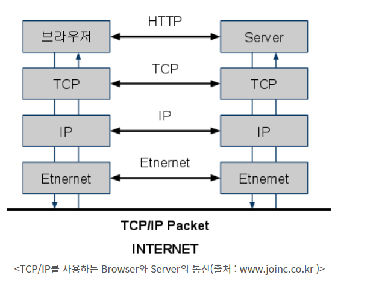
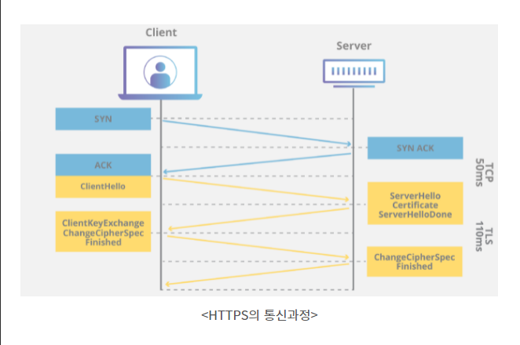

### TCP-IP

<B>인터넷 프로토콜 스위트(영어:Internet Protocol Suite)는 인터넷에서 컴퓨터들이 서로 정보를 주고 받는데 쓰이는 통신규약(프로토콜)의 모음이다. 인터넷 프로토콜 슈트중 TCP와 IP가 가장 많이 쓰이기 때문에 TCP/IP 프로토콜 슈트라고 불린다.</B>

<B> TCP/IP 패킷 통신 방식의 인터넷 프로토콜인 IP와 전송 조절 프로토콜인 TCP로 구성되어있다.IP는 패킷 전달 여부를 보증하지 않고, 패킷을 보낸 순서와 받는 순서가 다를 수 있다. TCP는 IP위에서 동작하는 프로토콜로, 데이터의 전달을 보증하고 보낸 순서대로 받게해 준다. HTTP,FTP,SMTP등 TCP를 기반으로 한 많은 수의 애플리케이션 프로토콜들이 IP위에서 동작하기 때문에 , 묶어서 TCP/IP로 부르기도 한다.</B>

- TCP/IP는 하나의 프로토콜이 아닌 TCP와 IP를 합쳐서 부르는 말
- TCP/IP를 사용하겠다는 것은 IP주소 체계를 따르며 TCP의 특성을 활용해 송신자오 ㅏ수신자의 논리적 연결을 생성하고 신뢰성을 유지하겠다는 것을 의미함
- 즉 TCP/IP란 송신자가 수신자에세 IP주소를 사용하여 데이터를 전달하고 그 데이터가 제대로 갔는지 너무 빠르지 않았는지 제대로 받았다고 연락이 오는지 등을 이야기 하는 것이다.

##### 전송 계층

- 송신자와 수신자 사이의 논리적 연결을 담당하는 부분으로 신뢰성 있는 연결을 유지할 수 있도록 돕는다.
- 즉 사용자간의 연결 확인 및 데이터가 제대로 전송되었는지를 확인하는 곳

##### 네트워크 계층

- IP가 활용되는 부분으로, 한 endpoint가 다른 endpoint로 가고자 할 경우, 경로와 목적지를 찾아줌 이를 routing이라고 하며 대역이 다른 ip들이 목적지를 제대로 찾아갈 수 있도록 돕는다.

- 무언가를 다운로드 할 때 중간에 끊기거나 빠지는 부분 없이 완벽하게 받을 수 있는 것은 TCP덕분이다. 
- 그렇기 때문에 HTTP, HTTPS,FTP,SMTP등 데이터를 안정적으로 보내는 것을 중요시하는 프로토콜들의 기반이 된다

- 위의 사진은 HTTPS의 통신과정을 나타낸다.
- HTTP에서 실행하는 3-WAY HANDSHAKE이후에 SSL HANDSHAKE를 추가적으로 시행한다.

### TCP의 개요

- 전송 제어 프로토콜 (TCP)은 IP의 핵심 프로토콜 중 하나로, TCP/IP라는 명칭으로 널리 불림,
- TCP는 근거리 통신망이나 , 인트라넷 , 인터넷에 연결된 컴퓨터에서 실행되는 프로그램 간에 일련의 옥텟을 안정적으로 교환할 수 있도록 도움
- TCP는 전송 계층에 위치한다. 네트워크의 정보 전달을 통제하는 프로토콜이자 인터넷을 이루는 핵심 프로토콜의 하나이다.
- IP가 목적지를 찾아가는 것에 중심을 둔다면 TCP는 송신자와 수신자가 모두 통신에 준비가 되었는지 그리고 통신 이후의 과정에 문제는 없는지 등을 확인함
- TCP HEADER에는 이를 나타내는 모든 정보들이 담겨 있으며 IP HEADER와  TCP HEADER를 제외한 TCP가 실을 수 있는 데이터의 크기를 '세그먼트'라고 한다.
- TCP는 IP의 정보 뿐 아니라 Port를 이용하여 연결한다.

### TCP의 특징

1. 흐름제어
   - 송신자는 자신이 한 번에 얼마나 보낼 수 있는지 , 수신자는 자신이 데이터를 어디까지 받았는지 끊임없이 확인하고 TCP Header내의 'Window size'를 사용해 보내고 받는 데이터의 양을 정한다.
   - window는 일정량의 데이터를 의미하며 송신자가 아닌 수신자가 결정한다.
   - 그 후 자신의 상황에 따라 window size를 조절하고 자신이 지금까지 받은 데이터 양을 확인하여 송신자에게 보낸다. 만약 수신자가 300번째 데이터를 받았으면 ack number에 1을 추가하여 301을 보낸다. 300번까지 받았으니 301번 부터 보내라는 의미이다. 그리고 이 데이터의 순서 번호를 표기한 것이 바로 Sequence Number이다.
2. 혼잡제어
   - 송신자와 수신자도 중요하지만 데이터가 지나가는 네트워크망의 혼잡 여부도 중요하다. 이러한 상황에서 발생할 수 있는 문제점을 해결하기 위해 'slow start'라는 방식이 사용된다. slow-start란 연결 초기에 송신자와 수신자가 데이터를 넉넉히 주고 받을 준비가 되어있어도 네트워크 망이 혼잡할 수 있기 때문에 처음에는 적은 양의 데이터를 송출하고 이후 점점 그 양을 늘려가는 것을 의미함

### 래퍼런스

https://aws-hyoh.tistory.com/entry/TCPIP-%EC%89%BD%EA%B2%8C-%EC%9D%B4%ED%95%B4%ED%95%98%EA%B8%B0