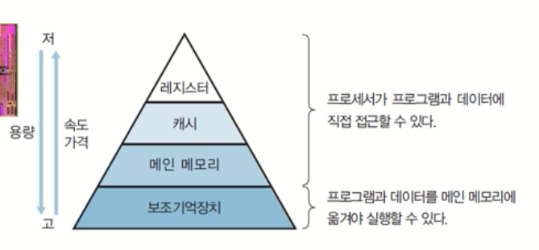
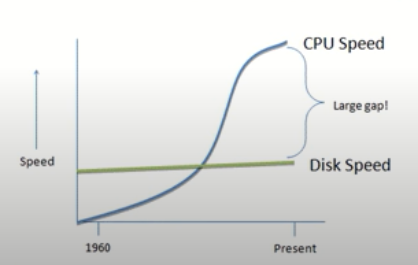
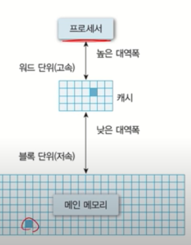
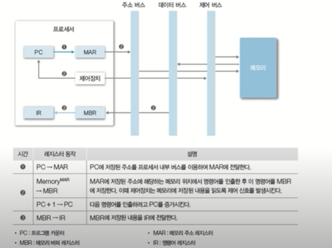

## 0. 컴퓨터 하드웨어

- 프로세서(Processor) -> 계산하는 역할
  - CPU
  - 그래픽카드(GPU)
  - 응용 전용 처리장치 등
- 메모리(Memory) -> 무언가 저장하는 역할
  - 주 기억장치
  - 보조 기억장치 등

- 주변장치
  - 키보드/마우스
  - 모니터,프린터
  - 네트워크 모뎀 등

## 1. 프로세서(Processor)

> 컴퓨터의 두뇌(중앙처리장치)

- 연산 수행
- 컴퓨터의 모든 장치의 동작제어

### 1.1 레지스터(Register)

- 프로세서 내부에 있는 메모리
  - 프로세서가 사용할 데이터 저장
  - 컴퓨터에서 가장 빠른 메모리

## 2. 메모리(Memory)

### 2.1 데이터를 저장하는 장치(기억장치)

- 프로그램(OS, 사용자sw등), 사용자 데이터 등

### 2.2 메모리의 종류

- 레지스터
- 캐시 (CPU)
- 메인 메모리 (DRAM)

- 보조기억장치(HDD)

#### 2.2.1 주기억장치 (Main memory)

- 프로세서가 수행할 프로그램과 데이터 저장
- DRAM을 주로 사용 => 용량이 크고, 가격이 저렴
- 디스크 입출력 병목현상 해소

[그래프 설명]

-  Disk는 속도가 발전이 더디고 CPU는 빠르게 발전 하여 갭이 생기게 됨

- CPU는 빠른데 메모리는 너무 느려서 문제가 발생

- 해결 => 디스크보다 용량 이 작지만 접근속도가 빠른 무언가 놓자 

- CPU가 일하는 동안 그사이에 필요한 다음에 필요한 데이터를 미리 가져다 놓자

- 다음 데이터가 필요할 때 이 메모리로부터 가져와서 쓰자 즉, 큰 갭을 메꾸자

- => 디스크까지 가는게 너무 느리니까 성능을 빠르게 하는 방해 요소 병목현상으로 작용하니까 해소하기 위해 메모리를 가운데 가져다 놓았다.

#### 2.2.2 캐시 (Cache)

- 프로세서 내부에 있는 메모리

  - 속도가 빠르고, 가격이 비쌈

- 메인 메로리의 입출력 병목현상 해소

- 캐시의 동작

  

  

  - 캐시가 없다면 바로 메인메모리로가기
  - 캐시가 있으면 캐시에서 먼저 데이터 확인하고 그래도 없으면 메인메로리에서 가져오고 프로세서로 다시 가져간다.

  - 일반적으로 HW적으로 관리 됨
  - 캐시 히트(Cache hit) : 필요한 데이터 블록이 캐시 존재
  - 캐시 미스(Cache miss) : 필요한 데이터 블록이 없는 경우

#### 2.2.3 지역성(Locality)

- 공간적 지역성

  - 참조한 주소와 인접한 주소를 참조하는 특성
  - ex) 순차적 프로그램 수행

- 시간적 지역성

  - 한 번 참조한 주소를 곧 다시 참조하는 특성

  - ex) For문 등의 순환 문

- 지역성은 캐시 적중률(cache hit ratio)과 밀접

  - 알고리즘 성능 향상 위한 중요한 요소 중 하나

#### 2.2.4 보조기억 장치

- 프로그램과 데이터를 저장
- 프로세서가 직접 접근할 수 없음 (주변장치)
- 용량이 크고 가격이 저렴

## 3. 시스템 버스(System Bus)

> 하드웨어들이 데이터 및 신호를 주고 받는 물리적인 통로

- 데이터 버스 : 데이터를 다루는 통로
- 주소 버스 : 주소를 다루는 통로
- 제어 버스 : 제어 신호를 다루는 통로

[참고]

- https://www.youtube.com/watch?v=EdTtGv9w2sA&list=PLBrGAFAIyf5rby7QylRc6JxU5lzQ9c4tN&index=1

