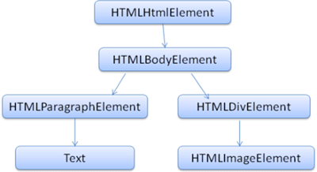

# 브라우저 동작 방법

### ✨브라우저의 주요 기능

브라우저의 주요 기능은 사용자가 선택한 자원을 서버에 요청하고 브라우저에 표시하는 것이다. 자원은 보통 HTML문서지만 PDF나 이미지 또는 다른 형태일 수 있다. 자원의 주소는 URI(Uniform Resource Identifier)에 의해 정해진다.


브라우저는 HTML과 CSS명세에 따라  HTML파일을 해석해서 표시하는데 이 명세는 웹 표준화 기구은 W3C(World Wide Web Consortium)에서 정한다. 과거에는 브라우저들이 일부만 이 명세에 따라 구현하고 독자적인 방법으로 확장함으로써 웹 제작자가 심각한 호환성 문제를 겪었지만 최근에는 대부분의 브라우저가 표준 명세를 따른다.


##### 브라우저의 사용자 인터페이스 요소

- URI를 입력할 수 있는 주소 표시줄
- 이전버튼, 다음버튼
- 북마크
- 새로 고침 버튼과 현재 문서의 로드를 중단할 수 있는 정지 버튼
- 홈 버튼


### ✨ 브라우저의 기본 구조

1. 사용자 인터페이스 	

   주소 표시줄, 이전/다음 버튼, 북마크 메뉴 등. 요청한 페이지를 보여주는 창을 제외한 나머지 모든 부분이다.

2. 브라우저 엔진

   사용자 인터페이스와 렌더링 엔진 사이의 동작을 제어

3. 렌더링 엔진 

   요청한 콘텐츠를 표시, (ex HTML을 요청하면 HTML과 CSS를 파싱하여 화면에 나타냄)

4. 통신 

   HTTP 요청과 같은 네트워크 호출에 사용. 이것은 플랫폼 독립적인 인터페이스이고 각 플랫폼 하부에서 실행됨

5. UI 백엔드

   콤보 박스와 창 같은 기본적인 장치를 그림. 플랫폼에서 명시하지 않은 일반적인 인터페이스로서, OS사용자 인터페이스 체계를 사용

6. 자바스크립트 해석기 

   자바스크립트 코드를 해석하고 실행

7. 자료 저장소

   쿠키를 저장하는 것과 같이 모든 종류의 자원을 하드 디스크에 저장, HTML5명세에는 브라우저가 지원하는 '웹 데이터 베이스'가 정의 되어있다. 


> 크롬은 각 탭마다 별도의 렌더링 엔진 인스턴스를 유지하는 것이 주목할 만하다. 각 탭은 독립된 프로세스로 처리된다.


### ✨ 렌더링 엔진

> 렌더링 엔진의 역할은 요청 받은 내용을 브라우저 화면에 표시하는 일이다.

#### 동작 과정

렌더링 엔진은 통신으로부터 요청한 문서의 내용을 얻는 것으로 시작하는데 문서의 내용은 보통 8KB 단위로 전송된다.


[렌더링 엔진의 기본 동작 과정]


1. 렌더링 엔진은 HTML문서를 파싱하고 "콘텐츠 트리" 내부에서 태그를 DOM노드로 변환한다. 
2.  외부 CSS파일과 함께 포함된 스타일 요소 파싱한다.
3.  스타일 정보와 HTML 표시 규칙은 "렌더 트리"라고 부르는 또 다른 트리를 생성한다. 
4. 렌드 트리는 색상 또는 면적과 같은 시각적 속성이 있는 사각형을 포함하고 있는데 정해진 순서대로 화면에 표시된다.
5. 렌드 트리 생성이 끝나면 배치가 시작, => 각 노드가 화면의 정확한 위치에 표시되는 것을 의미한다.
6. UI백엔드에서 렌더 트리의 각 노드를 가로지르며 형상을 만들어 내는 그리기 과정

*렌더링 엔진은 좀 더 나은 사용자 경험을 위해 가능하면 빠르게 내용을 표시하는데 모든 HTML을 파싱할 때 까지 기다리지 않고 배치와 그리기 과정을 시작한다. 네트워크로부터 나머지 내용이 전송되기를 기다리는 동시에 받은 내용의 일부를 먼저 표시한다. 


### ✨ 파싱과 DOM 트리 구축

문서 파싱은 브라우저가 코드를 이해하고 사용할 수 있는 구조로 변화하는 것을 의미한다. 파생 결과는 보통 문서 구조를 나타내는 노드 트리인데 파싱트리 또는 문법 트리라고 부른다. 

[DOM]

"파싱 트리"는 DOM요소와 속서어 노드의 트리로서 출력 트리가 된다. DOM은 문서 객체 모델(Document Object Model)의 준말이다. 이것은 HTML 문서의 객체 표현이고 외부를 향한 자바스크립트와 같은 HTML 요소의 연결 지점이다. 트리의 최상위 객체는 문서이다. 

```HTML
<html>
  <body>
   <p>Hello World</p>
   <div></div>
  </body>
</html>  
```



[위 마크업을 DOM트리로 변환]

트리가 DOM 노트를 포함한다고 말하는 것은 DOM 접점의 하나를 실행하는 요소를 구성한다는 의미이다. 브라우저는 내부의 다른 속성들을 이용하여 이를 구체적으로 실행한다. 


결국 파싱 과정을 거치면서 서버로부터 받은 문서를 브라우저가 이해하고 쉽게 사용할 수 있는 DOM 트리구조로 변환시켜주는 것이다. 


#### 정리

------

1. 주소창에 url를 입력하고 Enter를 누르면, 서버에 요청 전송
2. 해당 페이지에 존재하는 여러 자원들(text, image등)이 보내짐
3. 브라우저는 해당 자원이 담긴html과 css를 W3C 명세에 따라 해석 (이 역할을 하는 것이 '렌더링 엔진')
4. 렌더링 엔진은 우선 html 파싱 과정을 시작함. => DOM 트리 구축
5. CSS 파싱 => CSS 파서가 모든 CSS 정보를 스타일 구조체로 생성
6. 위 2가지를 연결시켜 렌더 트리를 만듦.  렌더 트리를 통해 문서가 시작적 요소를 포함한 형태로 구성된 상태
7. 화면에 배치를 시작, UI 백엔드가 노드를 돌며 형상을 그림
8. 자원을 전송받으면, 기다리는 동시에 일부분 먼저 진행하고 화면에 표시한다. 모두 받고 한꺼번에 화면에 보여주지 않는다. ! 


[참고]

- https://d2.naver.com/helloworld/59361