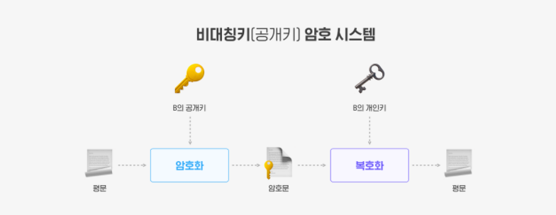

# HTTP & HTTPS

## 1. HTTP

> HyperText Transfer Protocol
>
> 서로 다른 시스템들 사이에서 통신을 주고받게 해주는 가장 기초적인 프로토콜

### 1-1. 구조

- HTTP는 애플리케이션 레벨의 프로토콜로 TCP/IP 위에서 작동
- HTTP는 상태를 가지고 있지 않는 Stateless 프로토콜이며 Method, Path, Version, Headers, Body 등으로 구성

- HTTP는 암호화가 되지 않은 평문 데이터를 전송하는 프로토콜이기 때문에, HTTP로 비밀번호나 주민등록번호 등을 주고 받으면 제3자가 정보를 조회하는 것이 가능

## 2. HTTPS

> HyperText Transfer Protocol Secure
>
>  HTTP에 데이터 암호화가 추가된 프로토콜

### 2-1. 비대칭키 (공개키/개인키)

- 공개키: 모두에게 공개가능한 키
  - 공개키로 암호화를 하면 개인키로만 복호화할 수 있다. 
    - 개인키는 나만 가지고 있으므로, 나만 볼 수 있다.

- 개인키: 나만 가지고 알고 있어야 하는 키
  - 개인키로 암호화하면 공개키로만 복호화할 수 있다.
    - 공개키는 모두에게 공개되어 있으므로, 내가 인증한 정보임을 알려 신뢰성을 보장할 수 있다.

### 2-2. 대칭키

- 대칭키: 암호화에 쓰이는 키와 복호화에 쓰이는 키가 동일
  - 클라이언트와 서버가 대칭키 방식으로 통신을 한다면 클라이언트도 키를 가지고 있어야 한다.
    - 클라이언트에게 키를 전달하기도 위험하며 클라이언트의 소스코드는 누구든지 열어볼 수 있으므로 가지고 있기도 굉장히 위험하다.

### 2-3. SSL(Secure Socket Layer)

- 서버와 브라우저 사이에 주고 받는 데이터를 암호화
- 데이터를 주고 받을 때 이것이 도난당하는 것을 방지 (Sniffing 방지)

### 2-4. HTTPS 동작 과정

1. 브라우저 마다 지원하는 암호화 알고리즘과 TLS 버전이 다르므로 해당 정보를 전송하며, 난수 값을 생성하여 전송
2. 사용할 TSL 버전, 사용할 암호화 알고리즘, 난수값을 전송
3. CA로 부터 발급받은 인증서를 전송
4. 키 교환에 필요한 정보를 제공
   - 만약 필요하지 않으면 이 과정은 생략이 가능 
   - 예를 들어 키교환 알고리즘을 Diffie-Hellman으로 사용한다면 소수, 원시근 등이 필요하므로 이것을 전송
5. 서버가 클라이언트를 인증해야할때 인증서를 요구하는 단계
   - 요청하지 않는 경우도 존재
6. 확인
7. pre-master-key를 전송
   - 이 키는 1,2 단계에서 생성한 난수를 조합하여 생성하게되며 대칭키로 사용하게될 예정입니다. 그러므로 안전한 전송을 위해서 공개키 방식을 사용하여 전송
8. 클라이언트로 부터 전송받은 pre-master-key를 정상적으로 복호화 후 master-key(대칭키)로 승격 및 보안 파라미터를 적용하거나 변경될때 보내는 알림을 전송

## 3. HTTP vs HTTPS

|                               |              HTTP              |                HTTPS                |
| :---------------------------: | :----------------------------: | :---------------------------------: |
|            보안성             |              낮음              |       높음 (SSL 인증서, TLS)        |
|             비용              |              낮음              | 높음 (인증서 유지, 트래픽 양 증가)  |
|             속도              |              빠름              | 느림 (차이를 거의 느끼지 못할 수준) |
|    SEO (검색 최적화 엔진)     |               무               |                 유                  |
| *AMP (가속화된 모바일 페이지) |               무               |                 유                  |
|             활용              | 개인 정보가 들어있지 않는 경우 |   개인 정보가 포함되어 있는 경우    |

- *AMP
  - 모바일 기기에서 훨씬 빠르게 콘텐츠를 로딩 하기 위한 방법으로 구글이 만든 것이다.
  - AMP는 HTML에서 불필요한 부분을 없앤 것이라고 볼 수 있다. 
  - 구글의 SERP(검색 결과 페이지)를 보면 스마트폰과 태블릿의 사용자들이 모바일에서 사용하기 편하도록 AMP 콘텐츠들이 두드러져 보이는 것을 볼 수 있다.

## reference

[http://blog.wishket.com/http-vs-https-차이-알면-사이트의-레벨이-보인다/](http://blog.wishket.com/http-vs-https-%EC%B0%A8%EC%9D%B4-%EC%95%8C%EB%A9%B4-%EC%82%AC%EC%9D%B4%ED%8A%B8%EC%9D%98-%EB%A0%88%EB%B2%A8%EC%9D%B4-%EB%B3%B4%EC%9D%B8%EB%8B%A4/)

https://mangkyu.tistory.com/98

https://brunch.co.kr/@hyoi0303/10

https://m.blog.naver.com/utk0415/221749026166

https://mysterico.tistory.com/30
