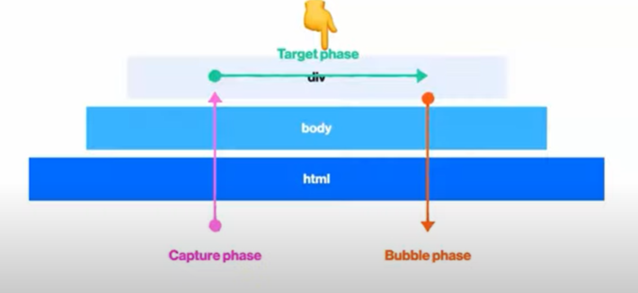
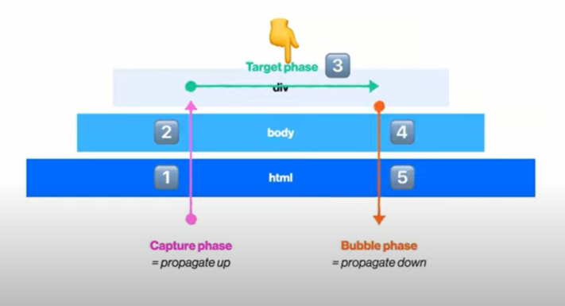
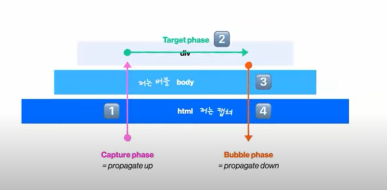
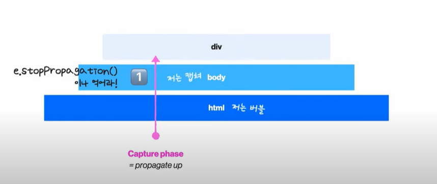

### Dom Event


- __브라우저에는 엄청나게 많은 이벤트들이 존재한다__
- __event handler = event listenr = event 콜백함수__


- __addEventListener()__

  ```javascript
  elementDiv.addEventListenr('click',function(){
      console.log('fire'), false
  })
  ```

  - elementDiv에게
  - 'click'이 일어나면
  - function을 실행하겠다.

- __onClick과 같은 방식도 존재 : 과거__

  - ```javasc
    elementDiv.onClick = function(){
    	console.log('fire')
    }
    ```


___________

__load__

__scroll__

__resize__

__blur__

__focus__

__change__

__submit__

__click__

__mousedown__

__mouseenter__ 

__mouseleave__

__mouseup__

__keydown__

__keyup__

_______________________________________________________

### 이벤트 캡쳐링/버블링


```html
<html>
    <body>
        <div>
            
        </div>
    </body>
</html>
```

- div에 이벤트를 설정할 경우 -> (이벤트의 시발점)
- div를 누른것은 body와 html을 누른것인가 아닌가?
- __브라우저님은 div를 눌렀을때 body와 html등 부모에서 같은 이벤트 핸들러가 있다면 이 친구들도 이벤트를 시킨다__
- currentTarget = 이벤트의 진짜 주인
- Target = 이벤트의 시발점
- div / currentTarget : div , target:div
- body / currentTarget : body , target:div


##### 이벤트 플로우

- 


- __capture phase / target phase / bubble phase 순서로 실행__
- 

- __div한번 누르고 싶을 뿐인데 1,2,4,5의 과정도 일어남__
- 

- __body와 html에게는 bubble할래? capture할래? 하나만 발생하게함__
- __브라우저는 기본적으로 버블때 실행되도록 설정되어있음__

```html
<html lang="en">
<head>
    <meta charset="UTF-8">
    <meta http-equiv="X-UA-Compatible" content="IE=edge">
    <meta name="viewport" content="width=device-width, initial-scale=1.0">
    <title>Document</title>
    <style>
        body{
            width:100%;
            height:100vh;
        }
        div {
            background-color: hotpink;
        }
    </style>
</head>
<body>
    <div>클릭</div>
    <script src='./event.js'></script>
</body>
</html>
```

```javascript
const html = document.documentElement
const body = document.body
const div = document.querySelector('div')

div.addEventListener('click',function(){
    console.log('DIV')
}, false)

body.addEventListener('click',function(){
    console.log('BODY')
}, false)

html.addEventListener('click',function(){
    console.log('HTML')
} ,false)

// false면 버블때 
// true면 캡쳐때
// 아무것도 안넣으면 false
```

- 일반적으로 버블임
- 이벤트를 정말 미세하게 컨트롤해야할 상황에 캡쳐를 사용함


___________________________

##### div를 눌렀을 때 div만 실행시키고 싶은데.....

- 캡쳐와 버블을 방지시킬 수는 없음 (캡쳐의 과정과 버블의 과정은 아예 안일어나게 할 수는 없다)
- 그러나 이벤트의 전파는 막을 수 있음 

```javascript
const html = document.documentElement
const body = document.body
const div = document.querySelector('div')

div.addEventListener('click',function(){
    console.log('DIV')
}, false)

body.addEventListener('click',function(){
    console.log('BODY')
}, false)

html.addEventListener('click',function(){
    console.log('HTML')
    e.stopPropagation()
} ,false)

// false면 버블때 
// true면 캡쳐때
// 아무것도 안넣으면 false
```



- __이런 경우에는 body만 실행되고 그 이후는 실행안됨__
- __그 다음 움직임부터는 막을 수 있음__

__________________

##### 이벤트리스너는 함수에 이벤트객체를 무조건 보내줌


래퍼런스

김버그님의 유튜브 강의

https://www.youtube.com/watch?v=7gKtNC3b_S8&list=PLsTXYDw7vAcRW9SZnHBeF4HKwATrNi0Gg&index=4