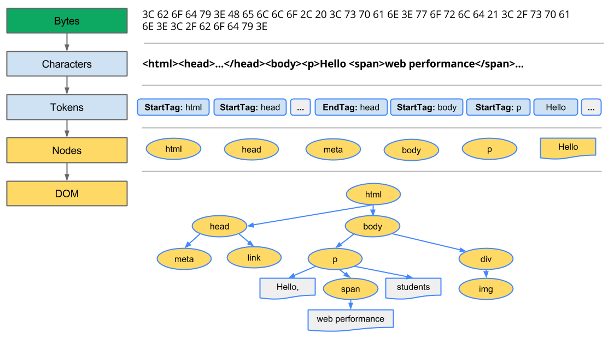

# 브라우저의 동작 과정 

대부분의 프로그래밍 언어는 운영체제 위에서 실행되지만 웹 애플리케이션의 Javascript는 브라우저에서 HTML,CSS와 함께 실행된다. 따라서 브라우저 환경을 고려하면 보다 효율적인 Javascript프로그래밍이 가능하다.!

#### [요약]

브라우저의 핵심 기능은 사용자가 참고하고자 하는 웹페이지를 서버에 요청하고 서버의 응답을 받아 브라우저에 표시하는 것이다.

브라우저는 서버로부터 HTML, CSS, Javascript, 이미지 파일 등을 응답받는다. HTML, CSS 파일은 렌더링 엔진의 HTML 파서와 CSS 파서에 의해 파싱되어 DOM, CSSOM 트리로 변환되고 렌더 트리로 결합된다. 

이렇게 생성된 렌더 트리를 기반으로 브라우저는 웹페이지를 표시한다.

## ✨렌더링 엔진의 동작 과정


1. HTML 마크업을 처리하고 **DOM 트리** 생성
2. CSS 마크업 처리 **CSSOM 트리** 생성
3. DOM 트리와 CSSOM 트리를 결합하여 **렌더링 트리** 생성
4. **렌더링 트리 배치** : 각 노드에 대해 화면에서의 정확한 위치와 크기 계산
5. **렌드 트리 그리기** : UI 백엔드에서 렌드링 트리의 각 노드를 가로지르며 렌더렝

위 과정들은 **점진적으로 진행**된다. 렌더링 엔진은 모든 HTML을 파싱할 때까지 기다리지 않고 배치와 그리기 과정을 시작한다. 네트워크로부터 나머지 내용이 전송되는 것을 기다리고 동시에 받은 내용의 일부를 먼저 화면에 표시한다. (더 나은 사용자 경험을 위해서!)

### 🔨1. DOM(Document Object Model) 트리 생성



HTML 페이지는 Bytes => 문자 변환 => 토큰화 => 노드 변환 => DOM 트리 생성 

DOM트리는 렌더링 될 때 어떻게 표시할지는 알려주지 않지만, 이 정보는 CSSOM이 알려주게 된다.


### 🔨2. CSSOM(CSS Object Model) 트리 생성

브라우저가 DOM을 생성하는 동안 `style.css`를 참조하는 문서의 링크 태그를 만나게 된다. 브라우저는 이 리소스에 대한 처리를 요청하고, 아래와 같은 결과가 나온다.

```css
body { font-size: 15px }
p { font-weight: bold}
span { color: red}
p span { display: none}
```


CSS는 Bytes => 문자 변환 => 토큰화 => 노드 변환 => CSSOM 트리 생성

#### 2.1 CSSOM이 트리 구조를 갖는 이유

스타일은 **하향식**으로 규칙을 적용한다. 페이지의 객체에 있는 스타일을 계산할 때, 브라우저는 해당 노드에 적용 가능한 가장 일반적은 규칙에서 구체적인 규칙을 적용한다.

#### 2.2 완전한 CSSOM 트리가 아니다.

브라우저가 기본적으로 제공한는 `user agent styles`에서 스타일 시트가 재정의 하도록 결정한 스타일만 표시한다. 


### 🔨3. 렌드링 트리 생성

1. DOM트리와 CSSOM 트리를 결합하여 렌더링 트리를 형성한다.
2. 렌더링 트리는 페이지에 표시되는 모든 DOM컨텐츠와 각 노드에 대한 모든 스타일 정보를 갖고 있다.

[렌더링 트리 생성 과정]

1. DOM 트리의 루트에서 시작하여 순회한다.
   - 렌더링이 되자 않은 `<script>`, `<meta>` 태그와 같은 노드들은 렌더링 트리에서 생략된다.
   - 일부 노드는 CSS를 통해 숨겨지며, 렌더링 트리에서도 생략된다. ex) `display: none`
2. 표시된 각 노드에 대해 매칭되는 CSSOM규칙을 찾고, 적용한다.
3. 표시된 노드를 컨텐츠와 스타일과 함께 내보낸다.


### 🔨4. 렌더 트리 배치 

1. 뷰포트 내에서 노드의 정확한 위치와 크기를 계산한다.
2. 페이지 내에서의 각 객체의 정확한 위치와 크기를 계산하기 위해, 브라우저는 렌더링 트리의 루트에서 시작하여 트리를 순회한다.
3. 레이아웃 과정의 결과는 **Box Model**이다. 박스 모델은 뷰포트 내에서 각 노드의 정확한 위치와 크기 정보를 담고 있다. 모든 상대적은 측정값은 화면에서의 **절대적인 pixel**로 변환된다. 


### 🔨5. 렌더 트리 그리기

마지막으로, 렌더링 트리의 각 노드를 화면에서 실제 픽셀로 변환한다. !


## 👀 script 태그

자바스크립트는 렌더링 엔진이 아닌 자바스크립트 엔진이 처리한다.

HTML 파서는 script 태그를 만나면 자바스크립트 코드를 실행하기 위해 DOM 생성 프로세스를 중지하고 자바스크립트 엔진으로 제어 권한을 넘긴다.

제어 권한을 넘겨 방은 자바스크립트 엔진은 script 태그 내의 자바스크립트 코드 또는 script 태그의 src어트리뷰트에 정의된 자바스크립트 파일을 로드하고 파싱하여 실행한다.

자바스크립트의 실행이 완료되면 다시 HTML 파서로 제어 권한을 넘겨서 브라우저가 중지했던 시점부터 DOM 생성을 재개한다.

#### [script 태그의 위치]

브라우저는 동기(Synchrounous)적으로 HTML, CSS, Javascript를 처리한다. script 태그의 위치에 따라 블로킹이 발생하여 DOM 생성이 지연될 수 있다는 것을 의미한다. 

따라서, script 태그의 위치는 중요하다.(body 요소의 가장 아래 위치)

- HTML 요소들이 스크립트 로딩 지연으로 인해 렌더링에 지장 받는 일이 발생하지 않아 페이지 로등 시간이 단축된다.
- DOM이 완성되지 않은 상태에서 자바스크립트가 DOM을 조작한다면 에러가 발생한다. 


[참고]

- https://poiemaweb.com/js-browser

- https://velog.io/@yejineee/%EB%B8%8C%EB%9D%BC%EC%9A%B0%EC%A0%80-%EB%8F%99%EC%9E%91-%EA%B3%BC%EC%A0%95
- https://d2.naver.com/helloworld/59361