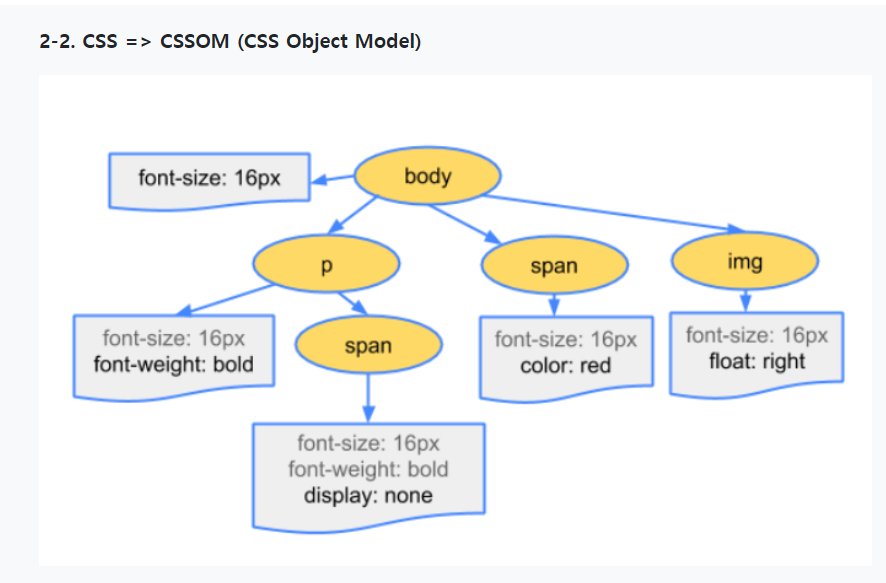

### 브라우저의 작동과정

__:checkered_flag: 브라우저란?__

- 브라우저의 핵심기능은 사용자가  보고자 하는 페이지를 서버에 요청하고 서버로부터 받은 응답을 브라우저에 표시하는 과정이다.

___________

__:checkered_flag: 렌더링이란?__

- HTML , CSS , JavaScript 등 개발자가 작성한 문서를 브라우저에 출력하는 과정을 의미함

- >JavaScript의 경우 __자바스크립트 엔진__에서 처리하고
  >
  >HTML,CSS는 __렌더링 엔전__에서 처리한다.

_____________________

__:checkered_flag: 렌더링 과정__

- 1. HTML, CSS를 다운로드

  2. 다운받은 HTML, CSS를 활용해 Object Model을 만듬

     - HTML => DOM 
     - CSS => CSSOM
     - 

     - 
     - 

     - > __Render Tree에는 실제 화면에 표현되는 노드(요소)들로만 구성됨__
       >
       > ex)
       >
       >  `display:none` 속성이 설정된 노드는 어떤 공간도 차지하지 않아 Render Tree에서 제외
       >
       > `visibility : invisible` 속성은 비슷하게 동작하지만, 공간은 차지하기 때문에 Render Tree에 포함됨

  3. Layout

     - 뷰포트 내에서 각 노드들의 정확한 위치와 크기를 계산함
     - __브라우저 화면의 어떤 위치에 어떤 크기로 출력될지 계산하는 단계__

  4. Paint 

     - Layout 계산이 완료되면 요소들을 실제 화면에 그린다.

______________

__:checkered_flag: HTML 파서가 script 태그를 만나면?__

- 자바스크립트는 자바스크립트 엔진이 처리한다.
- HTML 파서는 script태그를 만나면 자바스크립트 코드를 실행하기 위해 DOM 생성 프로세스를 중지하고 자바스크립트 엔진으로 제어 권한을 넘긴다.
- 제어권한을 받은 __자바스크립트 엔진__은 script 태그 내의 자바스크립트 코드 혹은 script의 src attribure에 정의된 js파일을 로드하고 __파싱/기계어로 컴파일__하여 __실행__한다.
- 자바스크립트 실행이 완료되면 다시 HTML 파서로 권한을 넘겨서 중지했던 부분부터 다시 DOM 생성을 재개한다.
- 보통 script위치에 의한 에러를 막기위해 body태그 맨 아래에 작성한다

------------------------------

##### D2정리

__:checkered_flag:브라우저의 기본구조__

1. 사용자 인터페이스 / __주소 표시줄 , 이전/다음 버튼 등 요청한 페이지를 보여주는 창이외의 부분__
2. 브라우저 엔진 / __사용자 인터페이스와 렌더링 엔진 사이의 동작을 제어__
3. 렌더링 엔진 / __요청한 콘텐츠를화면에 표시함__
4. 통신 / __HTTP__ 요청과 같은 네트워크 호출에 사용됨
5. UI백엔드 / __콤보박스와 창 같은 기본적인 장치를 그림__
6. 자바스크립트 해석기 / __자바스크립트 코드를 해석하고 실행__
7. 자료저장소 / __쿠키와 같이 자원을 저장하는 웹 데이터 베이스__

>TIP) 
>
>크롬의 경우 각 탭마다 별도의 렌더링 인스턴스를 가짐 
>
>즉 각 탭은 독립된 프로세스이다.

__렌더링 엔진__

- 요청 받은 내용을 브라우저 화면에 표시하는 역할
- HTML,XML,문서,이미지 심지어 PDF등도 표시 가능

__렌더링 엔진의 종류__

- __파이어 폭스는 모질라에서 만든 개코__
- __사파리와 크롬은 웹킷__

__동작 과정__

- __렌더링 엔진은 통신으로부터 요청한 문서의 내용을 얻는 것으로 시작하는데 문서의 내용은 보통 8KB 단위로 전송된다__
- __다음은 렌더링 엔진의 기본적인 동작과정이다.__
- 

__파싱과 돔트리 구축__

- __파싱 일반__
  - 문서파싱은 브라우저가 코드를 이해하고 사용할 수 있는 구조로 변환하는 것을 의미
  - 파싱결과는 보통 문서구조를 나태내는 노드트리이며 파싱트리라고도 부름
- __어휘분석 / 구분분석__
  - __어휘분석__
    - 자료를 토큰으로 분해하는 과정
    - 토큰은 유효하게 구성된 단위의 집합체 = 용어집
  - __구문분석__
    - 언어 구문 규칙에 따라 문서 구조를 분석해 파싱트리를 생성함
- __문서 => 어휘분석 => 구문분석=>파싱트리 생성__
- __파싱트리는 기계코드로 다시 한 번 변환된다__.

________________

__정리__

1. 주소창에 url를 입력하고 Enter를 누르면, 서버에 요청 전송
2. 해당 페이지에 존재하는 여러 자원들(text, image등)이 보내짐
3. 브라우저는 해당 자원이 담긴html과 css를 W3C 명세에 따라 해석 (이 역할을 하는 것이 '렌더링 엔진')
4. 렌더링 엔진은 우선 html 파싱 과정을 시작함. => DOM 트리 구축
5. CSS 파싱 => CSS 파서가 모든 CSS 정보를 스타일 구조체로 생성
6. 위 2가지를 연결시켜 렌더 트리를 만듦. 렌더 트리를 통해 문서가 시작적 요소를 포함한 형태로 구성된 상태
7. 화면에 배치를 시작, UI 백엔드가 노드를 돌며 형상을 그림
8. 자원을 전송받으면, 기다리는 동시에 일부분 먼저 진행하고 화면에 표시한다. 모두 받고 한꺼번에 화면에 보여주지 않는다. !

##### 래퍼런스

(https://d2.naver.com/helloworld/59361)

(https://velog.io/@ppohee/%EB%B8%8C%EB%9D%BC%EC%9A%B0%EC%A0%80-%EB%8F%99%EC%9E%91-%EC%9B%90%EB%A6%AC)

(https://velog.io/@st2702/%EB%B8%8C%EB%9D%BC%EC%9A%B0%EC%A0%80%EC%9D%98-%EB%A0%8C%EB%8D%94%EB%A7%81-%EA%B3%BC%EC%A0%95)

