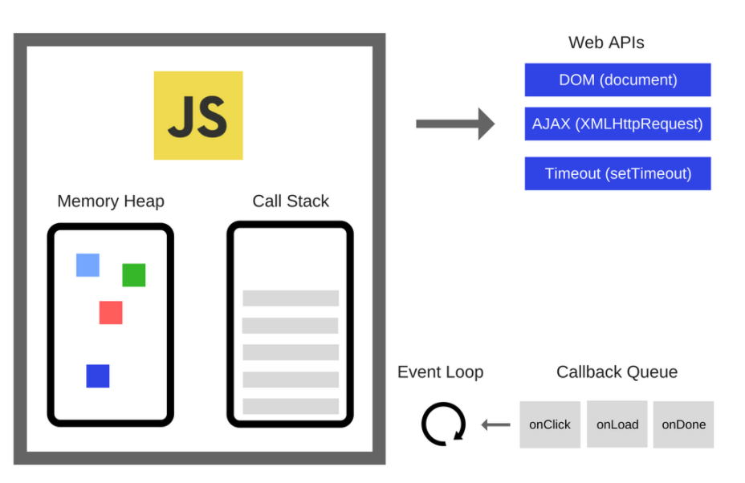
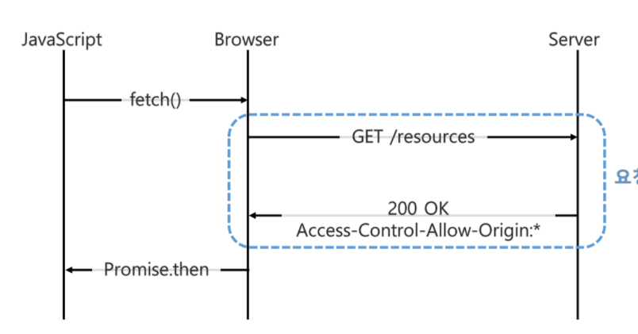
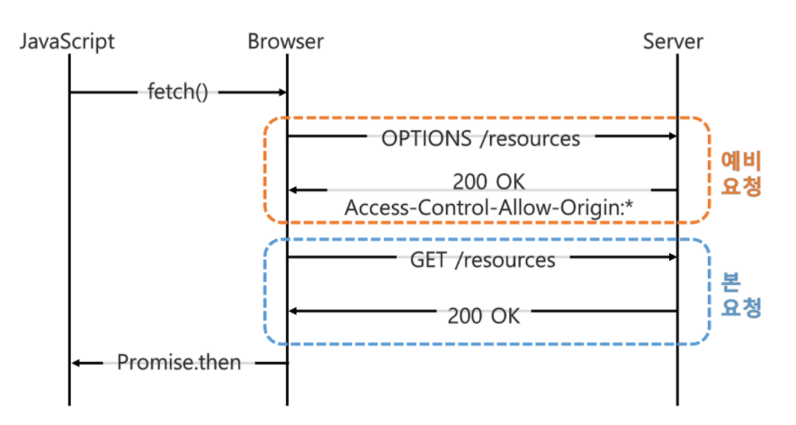

### 0915-16 우석 CS정리 (중복되는 내용나와도 다시하기)

--------------------------------------


##### :black_flag: 이벤트 루프에 대해서 설명해주세요



- 자바스크립트 엔진은 Memory Heap과 Call Stack으로 구성되어있다.
- 자바스크립트는 기본적으로 단일 스레드 언어인데 이 말은 콜 스택이 하나라는 것을 의미한다. (멀티적으로 처리하지 않고 하나씩 처리하는 것을 의미함)
- Memory Heap: 메모리 할당이 일어나는 곳
- Call Stack : 실행될 코드가 순서대로 쌓이는 곳


- Web API 

  - 자바스크립트 엔진의 밖에 그려져 있음 / 즉 JS엔진이 아니며 브라우저에서 제공하는 API이다
  - Call Stack에서 실행된 비동기 함수는 Web API를 호출하고, Web API는 콜백함수를 Callback Queue에 밀어 넣는다.

- Callback Queue

  - 비동기적으로 실행된 콜백함수가 보관되는 영역입니다.
  - 여기에 있는 콜백함수가 다시 콜스택의 최상단으로 가서 업무가 처리되면서 비동기적인 처리가 발생하는 것처럼 보임

- Event Loop

  - 이벤트 루트는 call stack과 call queue의 상태를 체크하여 call stack이 빈상태가 되면 call queue의 첫번째 콜백을 call stack으로 밀어넣는다. 이러한 반복적인 행동을 tick이라 부른다.

- __최종정리__

  - ```txt
    1. 코드가 실행되면, Call Stack에 실행될 코드가 쌓인다.
    2. Stack의 선입후출의 룰에 따라 제일 마지막에 들어온 함수가 먼저 실행되며, Stack에 쌓여진 함수가 모두 실행된다.
    
    - 비동기 함수가 실행된다면 Web API가 호출된다.
    - Web API는 비동기함수의 콜백함수를 Call queue에 밀어넣는다
    - Event Loop는 Call Stack이 빈 상태가 되면 Call Queue에 있는 첫번째 콜백을 Call Stack으로 이동시키며 이러한 반복과정을 tick이라 한다.
    ```

- 추가 공부 링크 : 큐가 다양해 질 수도 있다

  - (https://velog.io/@thms200/Event-Loop-%EC%9D%B4%EB%B2%A4%ED%8A%B8-%EB%A3%A8%ED%94%84)


##### :black_flag: 웹브라우저의 동작과정에 대해서 설명해주세요

- 1. 서버로부터 html , css등의 데이터를 받는다.
  2. Dom Tree , CSSOM Tree등을 생성한 후 이를 바탕으로 최종적인 렌더트리를 만든다
  3. 뷰포트내에서 정확한 위치와 크기를 계산한다
  4. 렌더링 트리의 각 노드를 실제 화면의 픽셀로 변환한다.
  5. js > css > html 순서로 우선순위를 가지고 있다.
- 추가 공부 링크 : 조금 더 세부적으로 다룬 블로그 글 
  - (https://velog.io/@yejineee/%EB%B8%8C%EB%9D%BC%EC%9A%B0%EC%A0%80-%EB%8F%99%EC%9E%91-%EA%B3%BC%EC%A0%95)

##### :black_flag: Vue 라이프사이클에 대해서 설명해주세요​ 

-  Vue 인스턴스나 컴포넌트가 생성될 때, 미리 사전에 정의된 몇 단계의 과정을 거치게 되는데 이를 __라이프싸이클__이라고 한다. 다시 말해, Vue 인스턴스가 생성된 후 우리 눈에 보여지고, 사라지기까지의 단계를 일컫는 과정
- Created : data를 반응형으로 추적할 수 있게되며 computed , methods, watch등이 활성화되어 접근이 가능한 상태이다. 주로 초기값 설정에 활용됨
- Mounted : 일반적으로 가장 많이 사용하는 훅이며 , 가상 DOM의 내용이 실제 DOM에 부착되고 난 이후 실행되므로 모든 요소에 접근가능하다.
  - 자식 컴포넌트가 서버에서 비동기로 데이터를 가져오는 경우 부모가 mounted되었다고 모든 자식이 mounted되었음을 보장하지는 않음. 이때는 this.$nextTick이라는 메서드를 이용해 해결 가능
- Updated : 가상 DOM을 렌더링하고 실제 DOM이 변경된 이후에 호출되는 updated훅입니다. 변경된 data가 DOM에도 적용된 상태이다. 만약 변경된 값들을 DOM에 활용하고 싶다면 Updated훅을 사용하는게 중요함. 그러나 data를 변경하는 것은 무한루프를 발생시킬 수 있으므로 데이터를 직접 바꾸어서는 안된다.
- Destroyed : 인스턴스에 접근할 수 없으며 하위 Vue인스턴스 역시 모두 삭제됩니다.
- __Before 시리즈__
- Created와 Mounted의 큰 차이는 Created는 부모 => 자식순으로 이뤄지고 Mounted는 자식 => 부모순으로 이뤄진다.


##### :black_flag: Tcp와 udp의 차이를 설명해주세요

- __전송 계층에서 사용하는 프로토콜__
- __전송 계층은 송신자와 수신자를 연결하는 통신서비스를 제공하는 계층으로서 쉽게 말하면 데이터의 전달을 담당하는 것이다__
- __TCP__ : `인터넷 상에서 데이터를 메시지의 형태로 보내기 위해 IP와 함께 사용하는 프로토콜`
- IP가 데이터의 배달을 처리한다면, TCP는 패킷을 추적 및 관리한다.
- 패킷 : 인터넷 내에서 데이터를 보내기 위한 경로배정을 효율적으로 하기 위해 데이터를 여러개의 조작들로 나누어 전송하는데 이를 패킷이라고 함. TCP는 패킷에 번호를 부여해 수신자가 올바르게 패킷을 조합할 있도록 도움
- 연결형 서비스로 가상 회선 방식을 제공한다.
- 3-way handshake 과정을 통해 연결을 설정하고 4-way handshake를 통해 해제한다.
- 흐름 제어 및 혼잡 제어를 한다.
  - 흐름 제어 : 데이터를 송수신하는 곳의 데이터 처리 속도를 조절하여 수신자의 버퍼 오버플로우를 방지하는 것이다.
  - 혼잡 제어 : 네트워크 내의 패킷 수가 넘치제 증가하지 않도록 방지하는 것이다.
- 높을 신뢰성을 보장한다. (스트리밍 서비스에 불리함)
- CPU를 사용하기 때문에 UDP보다 속도가 느리다. (응답이 필요하므로 느리기도 함)
- 전이중, 점대점 방식을 사용한다.
- __TCP는 결과적으로 연속성보다 신뢰성 있는 전송이 필요할 때 사용한다__


- __UDP__ : `데이터를 데이터그램 단위로 처리하는 프로그램`
  - 우리는 예전에 편지를 쓸 때, 편지지에 데이터를 기록하고, 편지봉투에 나의 주소와 상대방의 주소를 입력한 후 편지를 보내버린다. 그 후 우리는 편지가 도착했는지 안 했는지는 답장을 받아야만 알 수 있었다. UDP도 같은 방식으로 볼 수 있다. UDP는 먼저 데이터를 생성한 후 상대방의 주소와 나의 주소를 기록하고 보내버리면 해당 데이터를 받았는지 확인할 받법이 없다. 즉, **UDP의 통신 자체는 상대방과 연결되어 있는 개념이 아니다.**
  - 편지를 받는 사람 입장에서는 편지가 왔는지 안 왔는지 확인하는 방법은 편지함을 여는 것 뿐이다. 마찬가지로 UDP에서도 송신지에서 데이터를 보냈다 하더라도 UDP 소켓을 통해 자신의 포트를 열어보기 전까지는 데이터가 왔는지 안 왔는지 알 수가 없다. 즉, **자신의 로컬 머신에 소켓을 개설하고 데이터가 들어왔는지 안 들어왔는지 확인하는 매커니즘이 된다.**
- 서로다른 경로로 독립적으로 처리하기 때문에 패킷에 번호를 부여하여 흐름제어나 혼잡제어같은 기능을 사용할 수 없다
- 비연결형 서비스로 데이터그램 방식을 제공한다.
- 정보를 주고 받을 때 정보를 보내거나 받는다는 신호절차를 거치지 않는다.
- UDP 헤더의 CheckSum 필드를 통해 최소한의 오류만 검출한다.
- TCP 보다 속도가 빠르나 신뢰성이 낮다.


##### :black_flag: 객체지향 프로그래밍이란 무엇인가요?

- 객체 지향 프로그래밍은 컴퓨터 프로그래밍 패러다임중 하나로, 프로그래밍에서 필요한 데이터를 추상화 시켜 상태와 행위를 가진 객체를 만들고 그 객체들간의 유기적인 관계를 통해 로직을 구현하는 기법
- __객체 지향 프로그래밍의 장점__
  - 코드 재사용이 용이 => 클래스를 가져와서 사용 및 상속을 통해 새롭게 정의가 쉬움
  - 유지보수가 용이 => 기능별로 클래스내부에 구성되어 있기 때문에
  - 대형프로젝트에 용이 => 모듈화 하여 개발할 수 있으므로 업무 분담이 용이함
- __객체 지향 프로그래밍의 단점__
  - 처리 속도가 느림
  - 객체가 많으면 용량이 커진다
  - 설계시 많은 시간과 노력이 든다.
- __객체 지향 프로그래밍 5대키워드__
  - 클래스 + 인스턴스(객체) , 추상화 , 캡슐화 , 상속 , 다형성
- __클래스와 인스턴스(객체)의 차이는 무엇인가요?__
  - 클래스 : 어떤 문제를 해결하기 위한 데이터를 만들기 위해 추상화를 거쳐 집단에 속하는 속성과 행위를 변수와 메서드로 정의한 것
  - 인스턴스(객체) : 클래스에서 정의한 것을 토대로 실제 메모리상에 할당된 것
- __객체 지향 프로그래밍에서 추상화__
  - 불필요한 정보는 숨기고 중요한 정보만을 표현함으로써 공통의 속성이나 기능을 묶어 이름 붙이는 것
- __캡슐화가 무엇인가요?__
  - 캡슐화의 목적 : 코드를 재수정 없이 재활용하는 것
  - 프로그램 코드에서 변수와 함수를 재활용하기에는 분산되어 있어 재활용이 어려우므로 캡슐화를 통해 기능을  한 곳에 모은다.
- __상속이란 무엇인가요?__
  - 부모클래스의 속성과 기능을 그대로 이어받아 사용할 수 있게하고 기능의 일부분을 변경해야 할 경우 상속받은 자식클래스에서 해당 기능만 다시 수정하여 사용할 수 있게 하는 것
- __다형성이란 무엇인가요?__
  - 하나의 변수명 , 함수명이 상황에 따라 다르게 해석될 수 있는 것
  - __오버라이딩__: 부모클래스의 메서드와 같은 이름, 매개변수를 재정의 하는 것
  - __오버로딩__ : 같은 이름의 함수를 여러개 정의하고, 매개변수의 타입과 개수를 다르게하여 매개변수에 따라 다르게 호출할 수 있게 하는 것

- 추가 공부 링크 
  - (https://jeong-pro.tistory.com/95)

#####  

##### :black_flag: Dns과정에 대해서 설명해주세요

- __DNS는 IP주소를 기억하는 것이 어렵기 때문에 등장한 개념이다. DNS의 과정을 간략히 말하자면 웹에 www.naver.com을 입력하면 해당 주소에 대한 IP값을 알아내기 위해 사용자에게서 가장 가까이 위치한 DNS서버에 www.naver.com의 IP주소를 문의하여 접근한다.
- DNS Server는 IP주소와 Domain이름을 기억하는 기능과 Client가 Domain 이름을 물어보면 IP를 알려주는 기능을 갖고 있다.
  - 로컬 DNS서버에 해당 url이 등록되어 있는 지 확인 후 있으면 바로 ip주소를 알려준다
  - 만약 못찾을 경우 루트DNS 서버에 문의 후 루트 DNS는 최상위 도메인이 COM인것을 확인 후 ".com"이 등록된 네임 서버의 ip주소를 전달한다. 즉 루트 dns는 나는 모르니까 로컬 dns야 여기 com을 관리하는 DNS서버한테 물어봐
  - com을 관리하는 DNS서버는 로컬 DNS서버에 해당 IP를 알려준다. 또한 로컬 DNS는 이를 캐싱한다.
- 추가 공부 링크
  - (https://it-mesung.tistory.com/180)

#####  

##### :black_flag: Cors에 대해서 아는대로 다 설명해주세요

- `CORS Policy`를 위반할 때 발생하는 오류

- __출처란?__

  - protocol , host, port가 같은경우 동일출처로 표현됨

- __동일 출처 정책이란?__

  - 브라우저에서 시행하고 있는 정책으로 서로 다른 출처의 리소스 접근을 금지하는 것을 의미함
  - 서로 다른 출처의 리소스들이 서로 연결될 경우 XSS나 XSRF등의 보안 오류가 발생할 수 있기 때문에

  - __CORS란 외부 리소스를 사용하기 위해 동일 출처정책의 예외사항을 두는 것__

- __CORS 동작원리__

  - 단순 요청 방법과 예비 요청을 먼저 보내는 방법 . 즉 2가지 방법이 존재함
  - 단순 요청 방법은 서버에게 바로 요청을 보내는 방법이다. 아래 그림은 자바스크립트에서 API를 요청할 때 서버의 동작을 나타내는 그림입니다.



__단순 요청은 서버에 API를 요청하고, 서버는 `Access-Control-Allow-Origin`헤더를 포함한 응답을 브라우저에 보낸다. 브라우저는 `Access-Control-Allow-Origin`헤더를 확인해서 CORS 동작을 수행할지 판단함__

- __Simple Request 조건__

  - 서버로 전달하는 요청이 아래의 3가지 조건을 만족해야 서버로 전달하는 요청이 단순 요청으로 동작함
    - 1. 요청 메서드는 GET,HEAD,POST중 하나여야 합니다.
      2. Accept, Accept-Language, Content-Language, Content-Type, DPR, Downlink, Save-Data, Viewport-Width, Width를 제외한 헤더를 사용하면 안 됩니다.
      3. Content-Type 헤더는 application/x-www-form-urlencoded, multipart/form-data, text/plain 중 하나를 사용해야 합니다
  - 첫 번째 조건은 어렵지 않은 조건이지만 2번, 3번 조건은 까다로운 조건이다. 2번의 경우 인증에 사용되는 `Authorization`헤더를 사용할 수 없으며 3번의 경우 많은 REST API들이 `Content-Type`으로 사용하는 `Application/json`을 사용할 수 없기 때문
- __Preflight request__

  - Preflight request는 서버에 예비 요청을 보내서 안전한지 판단한 후 본 요청을 보내는 방법입니다.
  - 
  - Preflight요청은 실제 리소스를 요청하기 전에 `OPTIONS`라는 메서드를 통해 실제 요청을 전송할지 판단합니다.
  - `OPTIONS`메서드로 서버에 예비 요청을 먼저 보내고, 서버는 이 예비 요청에 대한 응답으로 `Access-Control-Allow-Origin`헤더를 포함한 응답을 브라워에 보냅니다. 브라우저는 단순 요청과 동일하게 `Access-Control-Allow-Origin`헤더를 확인해서 CORS 동작을 수행할지 수행할지 판단합니다. 
- __CORS 에러 해결 방법__

  - 서버에서 `Access-Control-Allow-Origin`헤더를 포함한 응답을 브라우저에 보내는 방식으로 CORS 에러를 해결할 수 있다.
- 프론트엔드 개발자가 CORS 에러를 확인했다면, 서버에 `Access-Control-Allow-Origin`등 CORS를 해결하기 위한 몇가지 응답 헤더를 포함해 달라고 요청해야함
  - __HTTP 응답 헤더__

    - __Access-Control-Allow-Origin:<origin>|*__

      - 추가적으로 연결가능한 origin을 적거나, 와일드카드를 활용해 모두 허용가능하게 설정 가능
- __Accesss-Control-Allow-Methods:<method>[,<method>*]__
  
  - 브라우저에서 보내는 요청 헤더에 포함된 `Access-Control-Request-Method`헤더에 대한 응답 결과로 리소스 접근을 허용하는 HTTP 메서드를 지정해주는 헤더입니다.
    - __Access-Control-Expose-Headers: <header-name>[, <header-name>]*__

      - 서버에서 응답 헤더에 `Access-Control-Expose-Headers`를 추가해 줘야 브라우저의 자바스크립트에서 헤더에 접근할 수 있습니다.
  - __Access-Control-Allow-Headers: <header-name>[, <header-name>]*__
      - 브라우저에서 보내는 요청 헤더에 포함된 `Access-Control-Request-Headers` 헤더에 대한 응답 결과입니다.
  - 이외에도 브라우저에서 서버로 보내주거나 서버에서 추가적으로 브라우저에 보내줘야하는 헤더들이 존재하기도 함, 그러나 대표적인 경우는 위의 네가지 이다.
- 추가 공부 링크
  - (https://beomy.github.io/tech/browser/cors/)


##### :black_flag: 함수형 프로그래밍이란 무엇인가요?

- `함수형 프로그래밍은 순수함수을 조합하고 공유상태, 변경 가능한 데이터 및 부작용을 피하여 프로그래밍하는 패러다임이다.`
- __연계성을 생각하기 보다는 함수를 이용해서 사이드 이펙트가 없도록 선언형 프로그램을 하는 것을 의미함__
- 순수함수 : 동일한 입력값을 넣었을 때 항상 동일한 리턴값을 반환하며 외부에 영향을 받지 않는 함수 (인자나 외부요인에 의해 리턴값이 변경되지 않음)
- __장점__
  - 사이드 이펙트를 미연에 방지한다. (상태를 사용하지 않음으로서)
  - 객체지향보다 코드가 간결하다.
  - 비절차형이라 평가 시점이 중요하지 않다.
  - 테스트가 쉽다
- __단점__
  - 외부 데이터 혹은 내부 데이터의 상태를 조작할 수 없다
- 객체지향 프로그래밍과의 차이
  - 객체지향 프로그래밍의 경우, 클래스 디자인과 객체들의 관계를 중심으로 코드 작성이 이루어진다. 따러서 상태, 멤버변수, 메서드 등이 긴밀한 관계를 가지고 있다. 특히 멤버변수가 어떤 상태를 가지고있는가에 따라 결과가 달라진다.
  - 함수형 프로그래밍의 경우, 값의 연산 및 결과 도출 중심으로 코드작성이 이루어진다. 함수 내부에서 인자로 받은 값을 별도로 저장하거나 하지 않고, 간결한 과정으로 처리하고 매핑하는데에 주 목적을 둔다. 
- 추가 공부 링크
  - (https://suminpixel.tistory.com/20)
  - (https://medium.com/@lazysoul/%ED%95%A8%EC%88%98%ED%98%95-%ED%94%84%EB%A1%9C%EA%B7%B8%EB%9E%98%EB%B0%8D%EC%9D%B4%EB%9E%80-d881230f2a5e)

