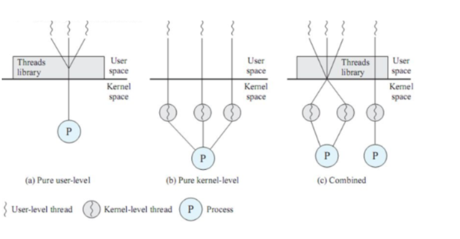

# 카카오 2차 준비하기 - cs테스트

______________________

__1. 프로세스와 쓰레드의 차이__

- :black_flag: __프로세스__
  - 실행 중인 프로그램 ( __PCB 블록__이 생성된 상태 , 프로그램이 실행되서 메모리에 적재된 경우 )
  - 자원을 할당받는 작업 단위
  - :heavy_check_mark: __프로그램과 프로세스의 차이__
    - __프로그램__ : 컴파일 코드, 전역변수 , 문자열 , 문자열 상수 등의 정적 데이터를 가진 __정적인 객체__
    - __프로세스__ : 스택 , 힙, 데이터, 메모리구조, 레지스터 처럼 현재 관리하는 자원정보를 가진 __동적인 객체__
- __:black_flag:쓰레드__
  - 작업이 실행되는 단위
  - 프로세스는 작업 + 제어로 구분되는데 이중 "제어"만 분리된 실행단위
  - 하나의 프로세스는 한 개 이상의 스레드로 나눌 수 있다.
  - 프로그램 카운터(PC) , 스택 포인터(SP)와 같은 스레드 실행환경 정보, 지역변수, 스택 등을 가진다.
  - __같은 프로세스 내의 스레드들은 관련 자원 및 메모리를 서로 공유한다__ => 효율적 자원관리
- __:black_flag: 멀티 프로세스와 멀티 스레드__
  - __멀티 프로세스__
    - 하나의 응용 프로그램을 __여러 프로세스__가 각각의 작업을 처리
    - 단점 - 모든 프로세스들은 각각의 고유한 메모리 영역을 가지므로 자원 공유 시 오버헤드가 크고 문맥교환에 많은 비용이 소모된다. 
    - __오버헤드__ : 어떤 처리를 하기위해 들어가는 간접적인 시간 및 메모리
  - __멀티 스레드__
    - 하나의 프로그램을 __여러 스레드__로 __병렬처리__하는 것
    - 장점 : 모든 스레드가 서로 자원과 메모리를 공유하므로 통신에 따른 오버헤드가 적다
    - 단점 : 교착상태가 발생하지 않도록 주의해야 한다.

__2. 사용자 수준 스레드, 커널 수준 스레드, 혼합 스레드__

- 메모리 영역은 사용자에 의해 할당되는 공간인 유저 영역과 운영체제라는 소프트웨어를 실행시키기 위해 필요한 공간인 커널 영역으로 나뉜다.
- 사용자레벨 스레드와 커널 레벨 스레드는 생성 주체가 누구인지에 따라 구분된다. 쓰레드를 생성하고 스케줄링하는 주체가 커널일 경우 커널 레벨 스레드이다.
- __:apple:사용자 수준 스레드__
  - 스레드와 관련된 모든 행위를 사용자 영역에서 한다.
  - 스레드 라이브러리를 이용하여 작동하는 형태
  - 단일 프로세서에서 작동 한다.
  - 커널이 스레드의 존재를 알지 못함.
  - 다수의 사용자 레벨 스레드가 커널 레벨 스레드 한개에 매핑 => __N:1 매핑__
  - __장점__ 
    - 이식성이 높다
    - 운영체제에서 스레드를 지원할 필요가 없다.
    - 커널 모드/유저 모드 간 전환이 일어나지 않기 때문에 오버헤드 적음
  - __단점__
    - 스레드간 보호 불가능
    - 프로세스에 속한 스레드 중 I/O 작업 등에 의해 하나라도 블록이 걸릴 경우 전체 스레드가 블록됨
- __:apple: 커널 영역 스레드__
  - 커널이 스레드와 관련된 모든 작업을 관리함(커널에 종속적)
  - __멀티 스레드 프로세스 환경__에서 동작한다.(동시에 다른 스레드로 작업 가능)
  - 커널이 각 스레드를 개별적으로 관리한다. => 1:1매핑
  - 사용자 수준 스레드의 한계 극복
  - __장점__ 
    - 각 커널이 스레드를 개별적으로 관리하므로 병행처리 가능
    - 커널이 직접 제공해주기 때문에 안정성과 다양한 기능이 제공된다.
  - __단점__
    - 커널-유저 모드간 전환이 빈번해서 오버헤드가 크다
- __:apple: 혼합형 스레드__
  - 사용자 수준 스레드 + 커널 수준 스레드 => __N:M매핑__

__3. 교착상태(DeadLock)와 기아상태__

- __:apple: 교착상태와 기아상태의 차이점__

  - __교착상태__ 
    - 자원을 자유롭게 할당한 결과(자원 부족)
    - 프로세스가 절대 일어나지 않을 사건을 기다리는 행위
    - 둘 이상의 프로세스가 다른 프로세스가 사용 중인 자원을 동시에 기다리는 행위
    - __교착 상태는 하나 이상의 작업에 영향을 주기 때문에 무한 대기나 기아 상태보다 더 심각한 문제를 일으킨다__

  - __교착 상태의 4가지 조건__
    - 아래의 4가지 조건이 __모두__ 만족할 경우 교착상태가 발생한다.
    - __상호 배제__ : 한 번에 하나의 프로세스 / 스레드만 해당 공유자원을 사용할 수 있는 것
    - __자원 점유__ : 하나의 자원을 소유하고 있는 프로세스 / 스레드가 다른 자원도 요청할 수 있는 것
    - __비선점__ : 한 프로세스 / 스레드가 다른 프로세스 / 스레드의 자원 접근 권한을 강제로 취소할 수 없는 경우
    - __순환 대기__ : 2개 이상의 프로세스 / 스레드가 공유자원을 기다리는데 그 관계에 싸이클이 있는 경우
  - __교착상태의 해결법__
    - 운영체제가 교착상태를 해결하지 못할 경우 시스템 운영자나 사용자가 작업을 교체하거나 종료하는 외부간섬으로 해결한다
    - 예방
    - 회피
      - 교착상태를 발생시킬 수 있다고 판단한 경우 프로세스를 시작 중지.
      - 교착상태를 발생시킬 수 있다고 판단한 경우 자원할당 거부
    - 회복 -> 이미 발생했을 경우 해결 알고리즘을 이용. ex) 프로세스 중단

  - __기아상태__ 
    - 기다리는 결과를 예방하기 위해 자원을 할당할 때 발생하는 결과
    - 프로세스의 우선순위가 낮아서 원하는 자원을 결코 할당받지 못하여 영원히 기다리는 상태

__4. 해시 테이블과 해시 테이블의 시간 복잡도__

- 해시 테이블은 (key,value)로 데이터를 저장하는 자료구조 중 하나로 빠른 데이터 검색이 필요할 때 유용합니다. 해시 테이블은 key값에 해시함수를 적용해 고유한 index를 생성하여 그 index에 저장된 값을 꺼내오는 구조입니다.
- 해시 테이블은 고유한 index로 값을 조회하기 때문에 평균적으로 O(1)의 시간 복잡도를 갖습니다. 하지만 해시의 index값이 충돌할 경우 index값에 대해 연결 데이터들을 조회하여 원하는 값을 찾아야하기 때문에 O(N)까지 시간복잡도가 증가함
- __해시 충돌__
  - 다른 내용의 데이터가 같은 키를 갖는 상황
  - 같은 키 값을 가지는 데이터가 생기는 것은 특정키의 버켓에 데이터가 집중된다는 뜻
  - 너무 많은 해시 춛올은 해시 테이블의 성능을 떨어뜨림

__5. 자바스크립트에서 HTTP request를 동기로 호출하고 값을 처리하면 발생하는 문제점은?__

- Request에 대한 Response 응답시간이 길어질 수도 있으므로 절차지향적으로 짜놓은 코드가 제대로 동작하지 않을 수 있음
- __해결방안은?__
  - CallBack함수를 만들어 호출하면 해당 Request에 대한 응답이 온 이후에 그 값을 가지고 다른 함수를 실행함
- __콜백함수의 문제점은? 그리고 해결방안은?__
  - 콜백함수를 이용한 비동기 처리를 많이 하면 '콜백헬'이라 불리는 가독성이 매우 떨어지는 코드가 됨. 가독성 저하는 유지보수에 걸림돌이 되므로 Promise나 Async/Await을 사용함. Promise에서는 요청 후 비동기 처리하는 부분은 then절에 추가하면 되고 Async/Await의 경우 Await이 then절의 역할
- __Promise vs Async/Await?__
  - Promise: Async/Await가 Promise로 구성되어 있으므로 Promise를 잘 모르면 Async/Await도 잘 쓸 수 없음. Promise로 다양한 비동기 처리를 경험해보고 다양한 오류를 처리해 봐야 함
  - Async: try & catch를 이용해서 예외처리를 할 수 있고, 간단한 비동기 처리 경우에는 가독성이 뛰어남

__6. 브라우저 주소창에 http://www.naver.com 입력 후 엔터를 눌렀을 때부터 페이지가 렌더링 되는 과정을 설명하세요.__

(1)  Local DNS -> 루트 DNS 서버 -> .com DNS 서버 -> naver.com DNS 서버 순서대로 www.naver.com에 해당하는 IP주소를 요청하고, 그 후 주소가 존재하는 주소라면 그 서버에서 바로 주소를 받음

(2) TCP 통신을 통해 소켓 개방

(3) HTTP 프로토콜로 요청

(4) 라우팅 중 프록시 서버를 만나면 웹 캐시에 저장된 정보를 response 받음

(5) 프록시 서버를 만나지 못해  www.naver.com을 서빙하는 서버까지 가면 요청에 맞는 데이터를 response로 전송함

(6) 브라우저의 loader가 해당 response를 다운로드 할지 말지 결정

(7) 브라우저의 웹 엔진이 다운로드한 .html 파일을 파싱해 DOM 트리를 결정

(8) .html 파싱중 script 태그를 만나면 파싱을 중단함

(9) script 태그에 있는 자원을 다운로드해 처리가 완료되면 다시 파싱을 진행함

(10) CSS parser가 .css파일을 파싱해 스타일 규칙을 DOM트리에 추가하고 렌더 트리를 만듬

(11) 렌더트리를 기반으로 브라우저의 크기에 따라 각 노드들의 크기를 결정

(12) 렌더링 엔진이 배치를 시작(페인팅) 

// JS는 무조건 HTML 파싱을 멈추게함, 그러나 CSS는 어떤식으로 적용되었냐에 따라 다름

// 그러나 대부분의 브라우저는 CSS파일을 받기전 까지 HTML 파싱을 멈춤

래퍼런스 

(https://sujinhope.github.io/2019/12/19/CS-%EC%9A%B4%EC%98%81%EC%B2%B4%EC%A0%9C(OS)-%EB%A9%B4%EC%A0%91-%EC%A7%88%EB%AC%B8(%EA%B8%B0%EC%88%A0%EB%A9%B4%EC%A0%91-%EB%8C%80%EB%B9%84).html)

(https://mangkyu.tistory.com/89)

(https://j3sung.tistory.com/759)

(https://hyonee.tistory.com/136)

(https://dkmqflx.github.io/frontend/2020/09/14/jscssom/)