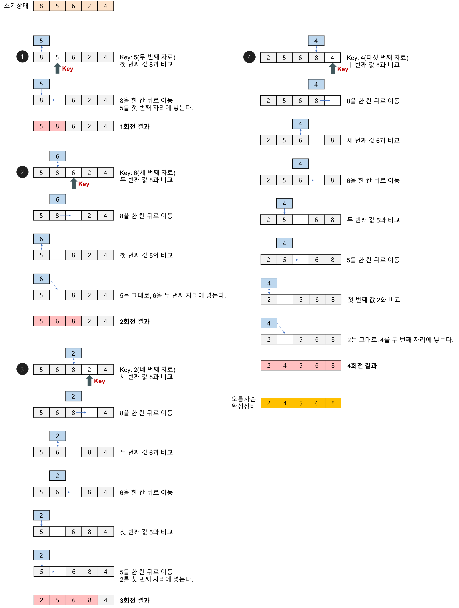

# 정렬 알고리즘

## 1. 거품 정렬 (Bubble Sort)

### 1.1 개념

- 서로 인접한 두 원소를 검사하여 정렬하는 알고리즘
  - 인접한 2개의 레코드를 비교하여 크기가 순서대로 되어 있지 않으면 서로 교환한다.

### 1.2 과정

- 버블 정렬은 첫 번째 자료와 두 번째 자료를, 두 번째 자료와 세 번째 자료를, ``` 마지막 자료까지 비교하여 교환하며 자료를 정렬한다.
- 1회전을 수행하고 나면 가장 큰 자료가 맨 뒤로 이동하므로 2회전에서는 맨 끝에 있는 자료는 정렬에 제외 되고 반복하여 정렬을 1회전 수행할 때마다 정렬에서 제외되는 데이터가 하나씩 늘어난다.

### 1.3 예제

- 배열 [7, 4, 5, 1, 3] 을 오름차순으로 정렬하기


### 1.4 코드 ( Python )

```python
arr = [7, 4, 5, 1, 3]
for i in range(len(arr)):
    for j in range(len(arr)-i-1):
        if arr[j] > arr[j+1]:
            arr[j], arr[j+1] = arr[j+1], arr[j]
         
for i in range(len(arr)-1,0,-1):
    for idx in range(i):
        if arr[idx] > arr[idx+1]:
            temp = arr[idx]
            arr[idx] = arr[idx+1]
            arr[idx+1] = temp
print(arr)
```


## 2. 선택 정렬 (selection sort)

### 2.1 개념

- Bubble Sort와 유사한 알고리즘으로, 해당 순서에 원소를 넣을 위치는 이미 정해져 있고, 어떤 원소를 넣을지 선택하는 알고리즘이다. 

### 2.2 과정

- 주어진 배열 중에서 최솟값 찾기

- 그 값을 맨 앞에 위치한 값과 교체
- 맨 처음 위치를 뺀 나머지 리스트를 같은 방법으로 교체
- 하나의 원소만 남을 때까지 위의 과정 반복

### 2.3 예제

- 배열 [9, 6, 7, 3, 5] 오름차순으로 정렬하기


### 2.4 코드 ( Python )

```python
arr = [9, 6, 7, 3, 5]
for i in range(len(arr)):
    idx = i
    for j in range(i+1,len(arr)):
        if arr[idx] > arr[j]:
            idx = j 
    arr[i], arr[idx] = arr[idx], arr[i]
print(arr)
```


## 3. 삽입 정렬 (Insertion sort)

### 3.1 개념

- 손안의 카드를 정렬하는 방법과 유사하다.
  - 새로운 카드를 기존의 정렬된 카드 사이의 올바른 자리를 찾아 삽입한다.
  - 새로 삽입될 카드의 수만큼 반복하게 되면 전체 카드가 정렬된다.
- 자료 배열의 모든 요소를 앞에서부터 차례댈 이미 정렬된 배열 부분과 비교 하여, 자신의 위치를 찾아 삽입함으로써 정렬을 완성하는 알고리즘
- 매 순서마다 해당 원소를 삽입할 수 있는 위치를 찾아 해당 위치에 넣는다.

### 3.2 과정

- 정렬은 2번째 위치(index) 의 값을 temp에 저장한다.
- temp와 이전에 있는 원소들과 비교하여 삽입해나간다.
- 1번으로 돌아가 다음 위치(index) 의 값을 temp에 저장하고 반복한다.

### 3.3 예제

- 배열 [8, 5, 6, 2, 4] 오름차순으로 정렬



### 3.4 코드 ( Python )

```python
arr = [8, 5, 6, 2, 4]
for i in range(1,len(arr)):
    temp = arr[i]
    for j in range(i,0,-1):
        if arr[j-1] > arr[j]:
            arr[j-1], arr[j] = arr[j], arr[j-1]
print(arr)
```


[참고]  

- https://gmlwjd9405.github.io/2018/05/06/algorithm-bubble-sort.html

- https://gmlwjd9405.github.io/2018/05/06/algorithm-selection-sort.html

- https://gmlwjd9405.github.io/2018/05/06/algorithm-insertion-sort.html