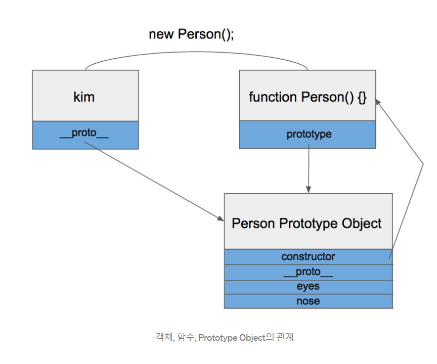

### 자바스크립트는 프로토타입 언어라고 하는데 프로토타입 언어란 대체 무엇일까?


##### Prototype VS Class

- Python , Java , Ruby 등 : `객체지향언어` , Class라는 개념을 통해 객체를 구성함
- JavaScript : `객체지향언어`  , ECMA6 최신 문법에서 Class관련 내용이 추가되었으나 아직까지는 전형적인 Prototype 중심언어


##### Prototype은 어디에 쓰는가?

```javascript
function Person() {
    this.eyes = 2;
    this.nose = 1;
}

var kim = new Person();
var park = new Person();

console.log(kim.eyes); // => 2
console.log(kim.eys); // => 1

console.log(park.eyes); // => 2
console.log(park.nose); // => 1
```

- <b>자바스크립트는 클래스가 존재하지 않지만 함수 function과 new를 통해 클래스와 유사한 기능을 표현할 수 있다.</b>
- <b>kim과 park은 eyes와 nose를 공통적으로 가지고 있으며, 메모리에는 eyes와 nose가 두 개씩 총 4개가 할당된다.</b> 
- `객체를 100개 만들면 200개의 변수가 메모리에 할당된다.`
- 이러한 문제는 프로토타입을 활용해 해결할 수 있다.


```javascript
function Person() {}

Person.prototype.eyes = 2;
Person.prototype.nose = 1;

var kim = new Person();
var park = new Person();

console.log(kim.eyes); // => 2
```

- <b>Person.prototype이라는 빈 object가 어딘가에 존재하고, PERSON 함수로부터 생성된 객체 kim과 park은 어딘가에 존재하는 object에 들어있는 값을 모두 갖다 쓸  수 있다.</b>
- 즉 eyes와 nose를 어딘가에 있는 빈 공간에 넣어놓고 kim과 park이 이를 공유해서 사용한다.


##### Prototype Object와 Prototype Link

- 자바스크립트에는 Prototype Link와 Prototype Object라는 것이 존재하며 이둘을 통틀어 Prototype이락 부릅니다. Prototype을 좀 안다는 것은 이 둘을 완벽히 이해하고 갖고 놀 수준이 되었음을 의미합니다.


##### Prototype Object

- 객체는 언제나 함수로 생성됩니다.

- ```javascript
  function Person() {} // 함수
  var personObject = new Person(); // 함수로 객체를 생성
  ```

- PersonObject 객체는 Person이라는 함수로 생성된 객체이며 이와 같이 객체는 언제나 함수에서 시작됩니다

  - ```javascript
    var obj = {};
    ```

  - 얼핏보면 함수와 전혀 상관없는 코드로 보이지만 위 코드는 사실 다음 코드와 같습니다.

  - ```javascript
    var obj = new object();
    ```

  - 위 코드의 object는 자바스크립트에서 기본으로 제공하는 함수입니다.

  - object와 마찬가지로 Function,Array등도 모두 함수로 정의되어 있습니다.

- <b>이는 굉장히 중요한 포인트인데 함수가 정의될 때는 2가지 일이 동시에 이루어지기 때문입니다.</b>


##### 1. 해당 함수에 Constructor(생성자) 자격 부여

- Constructor 자격이 부여되면 new를 통해 객체를 만들어 낼 수 있게되며, 이것이 함수만이 new 키워드를 사용할 수 있는 이유이다. 
- 즉 함수 -> Constructor 부여됨 -> new 사용가능


##### 2. 해당 함수의 Prototype Object 생성 및 연결

- 함수를 정의할 경우 함수만 생성되는 것이 아니라 Prototype Object도 같이 생성됨
- 

- 그리고 생성된 함수는 prototype이라는 속성을 통해 Prototype Object에 접근할 수 있습니다.
- Prototype Object는 일반적인 객체와 같으며 기본적으로 constrouctor와 __proto__라는 속성을 가지고 있습니다.
  - constructor는 Prototype Object와 함께 생성된 함수를 가리킵니다.
  - __proto__는 Prototype Link입니다.
- Prototype Object는 일반적인 객체이므로 속성을 마음대로 마음대로 추가/삭제 할 수 있다.


##### Prototype Link


- 앞에서 작성한 코드의 kim에는 eyes라는 속성이 없는데도 kim.eyes를 실행하면 2라는 값이 참조되는 것을 볼 수 있다. `이는 Prototype Object`에 존재하는 eyes 속성을 참조한 것이다.
- 이러한 기능이 가능한 이유는 kim이 가지고 있는 __proto__라는 속성 때문이다. 
  - Prototype 속성은 함수만 가지고 있지만 이와 반대로 __proto__ 속성은 모든 객체가 빠짐없이 가지고 있는 속성이다.
  - __proto__는 객체가 생성될 때 조상이였던 Prototype Object를 가리킨다. kim객체는 Person함수로 부터 생성되었으니 자연스레 Person함수의 Prototype Object를 가리킨다.



kim객체가 eyes를 가지고 있지 않기 때문에 eyes 속성을 찾을 때 까지 상위 프로토타입을 탐색합니다. 만약 최상위의 Prototype Object에 도달했는데도 값을 찾지 못하는 경우 undefined를 리턴합니다. 이처럼 __proto__속성을 통해 상위 프로토타입과 연결되어 있는 것을 프로토타입 체인이라고 한다


래퍼런스

https://medium.com/@bluesh55/javascript-prototype-%EC%9D%B4%ED%95%B4%ED%95%98%EA%B8%B0-f8e67c286b67