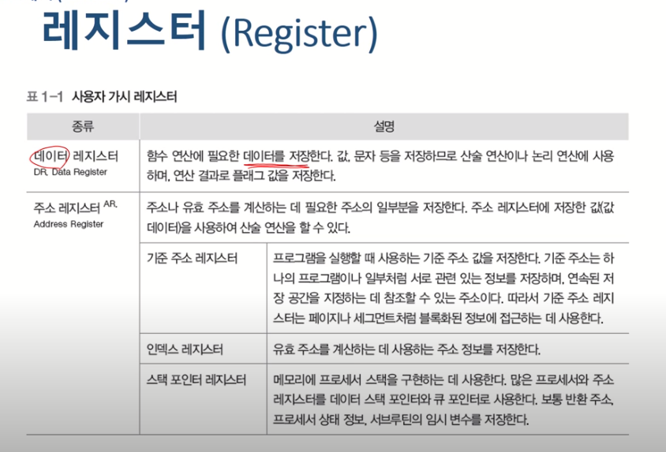
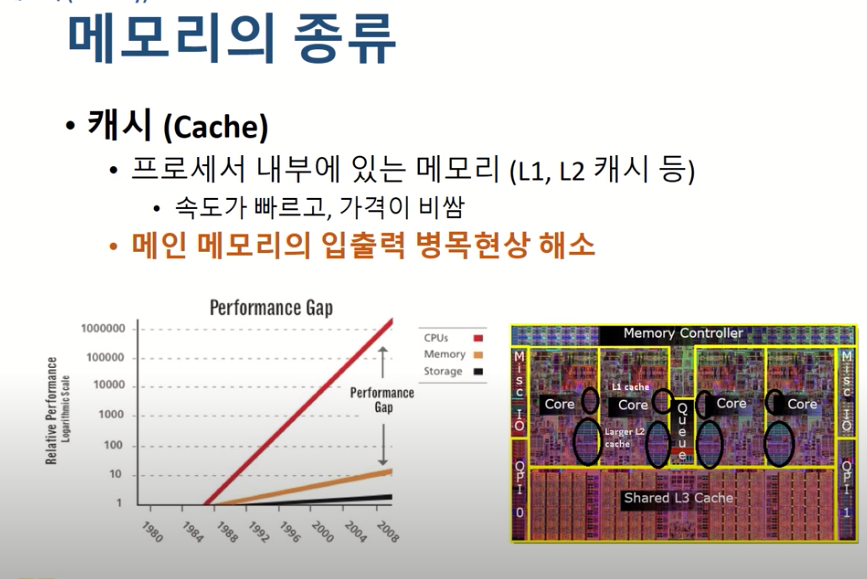
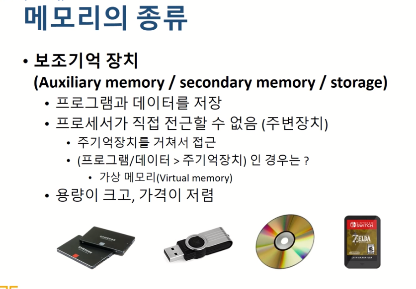

#### 운영체제 1강 Re:Start!!

##### 운영체제란 무엇인가?

- 사용자에게 하드웨어를 효율적으로 관리하는 서비스를 제공하는 소프트웨어

컴퓨터 하드웨어는 크게 세가지로 나뉘어짐

1. 프로세서 : 계산하는 장치 (ex.cpu.gpu,응용전용 처리장치 등)
2. 메모리 : 기억하는 장치 (ex. DRAM 등)
3. 주변장치 : 그외의 모든 장치 (ex. 입출력 장치 , 네트워크 장치)

### :checkered_flag: 프로세서

- 중앙처리 장치
- 연산수행 및 컴퓨터의 모든 장치 동작을 제어함

- 레지스터 : 프로세서 내부에 있는 메모리
- 프로세서가 사용할 데이터를 저장 / 컴퓨터에서 가장 빠른 메모리

레지스터의 종류

- 용도에 따른 분류 : 전용 , 범용
- 사용자가 정보 변경 가능 여부에 따른 분류 : 가시 , 불가시
- 저장하는 정보에 따른 분류 : 데이터 , 주소 , 상태

- 프로그램 카운터 : 우리가 다음에 실행할 명령어의 위치(코드 및 데이터 주소 등)를 나타냄
- 명령어 레지스터 : 프로그램 카운터에서 들어온 현재 실행중인 명령어를 보관하는 레지스터

##### 운영체제는 프로세서에게 처리할 작업을 할당 및 관리한다.

##### 프로그램의 프로세서 사용 제어 : 너무 많은 프로그램이 돌 경우 지금 너 A 프로그램 프로세서 그만써!!! 일단 다른애 먼저!!

##### 메모리 할당 및 관리

##### 가상메모리 관리

##### 장치드라이버 관리 : 그래픽 카드 드라이버등 -> 운영체제에게 그래픽 카드의 제어권을 줄 수 있는 통로를 만드는 과정

##### 인터럽트 처리 : 키보드의 입력 (인터럽트)

##### 파일 및 디스크 관리

##### 캐시 : CPU안에 위치하지만 레지스터 보다는 코어에서 먼 곳에 위치

### :checkered_flag: 주 기억 장치

- 특정 프로그램을 수행할 때 해당 프로그램은 반드시 메인 메모리 안에 들어가 있어야함
- cpu(프로세서)가 직접 접근할 수 있는 최대한의 범위는 메인메모리 이다.
- 왜 디스크로 바로 가지 않고 굳이 메인메모리를 거쳐서 저장정보를 가져올까?

- cpu의 속도가 disk 속도의 속도보다 너무 빨라져서 cpu의 disk에 cpu가 직접 접근할 경우 cpu의 최대성능을 발휘하지 못함.
- 그래서 cpu와 disk사이에 cpu보다는 느리지만 disk보다는 빠른 장치들을 가져다 놓음.
- cpu가 작업하는 동안 하드디스크에서 정보를 가져와 중간 장치에 정보를 미리 넣어놓음

- 메인메모리와 프로세서도 cpu와 하드디스크처럼 속도 차이가 너무나서 cpu와 메모리사이의 속도 차이도 같은 방식으로 해결하기 위해 캐시를 사용. (캐시도 레벨이 더욱 많아지는 중)
- 캐시의 크기는 매우 작음 예를들어 128KB

- 프로세서가 필요한 정보가 없을 경우 캐시에 먼저가서 물어보고 없을경우 캐시가 메인메모리로 가서 데이터를 가져와서 프로세서에게 전달
- 필요한 정보가 캐시에 있는 경우 캐시히트
- 필요한 정보가 캐시에 없는 경우 캐시미스

- 캐시히트의 효과는 매우 크다.

- 공간적 지역성 : 우리가 A를 참조할 경우 다음에는 A주변을 참조할 가능성이 크다.
- 시간적 지역성 : 한 번 참조하나 주소를 다시 참조할 가능성이 크다.
- 캐시의 경우 특정 A를 읽을 경우 A주변을 캐시라인만큼 더욱 가져옴(공간적 지역성을 위해)

- A형식은 캐시히트가 계속 발생, 그러나 B의 경우 캐시미스가 계속발생

- 우리가 하려는 게임이 20GB인데 메인메모리가 8G일 경우 가상 메모리라는 방법이 활용됨

래퍼런스

(본 자료는 한국 기술 교육 대학교 , 김덕수 교수님의 강의를 바탕으로 직접 정리 하였습니다.)

(https://www.youtube.com/playlist?list=PLBrGAFAIyf5rby7QylRc6JxU5lzQ9c4tN)

(https://sites.google.com/view/hpclab/courses/operating-system)

강의에 사용된 슬라이드나 영상 내용이 너무 많아 전부 정리하기 보다는 제가 영상을 보면서 이해가 쉽지 않았던 부분을 중점적으로 정리하였습니다.