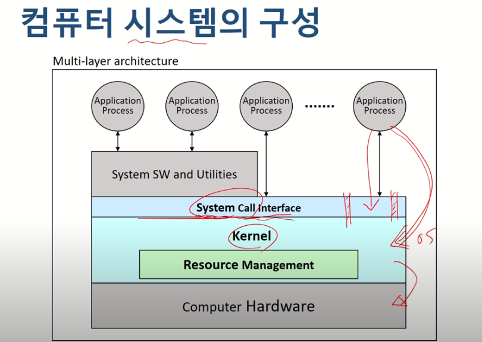

#### 2강

##### :cake: 운영체제의 역할

##### 1. 편리성

- CUI
- GUI
- EUCI : (특별한 목적을 위해 End-User Comfortable Interface) : 예시 : mp3만의 UI

##### 2. 효율성

- 하드웨어 자원 (ex.프로세서 , 메모리 등)
- 소프트웨어 자원 (file,application 등)

##### 3. 프로세스와 스레드 관리 

- 프로세스는 쉽게 말해 <b>실행주체</b>

##### 4. 시스템 보호

#### 컴퓨터 시스템의 구성

- System Call Interface : <b>사용자가 커널을 직접 엑세스하면 문제가 발생함. 그래서 마음대로 조작하는게 아닌 필요한 기능이 있으면 os에게 요청 후 작업을 하는데 요청하는 통로를 의미함</b>

  - 커널이 제공하는 기능 중 사용자가 사용할 수 있는 기능을 모아놓은 곳

- 

  -

- 

  - 시스템 라이브러리가 System call Interface

- 운영체제의 구분

  - <b>동시 사용자 수</b>

    - single-user system : ex. windows,android 등
      - 한명의 사용자만 시스템 사용 가능
      - 자원관리 및 시스템 보호 방식이 간단함
    - multi-user system
      - 동시에 여러 사용자들이 시스템 사용
      - 각종 시스템 자원(파일 등)들에 대한 소유 권한 관리 필요
      - 기본적으로 Multi-tasking 기능 필요
      - OS의 기능 및 구조가 복잡
      - 서버, 클러스터 장비등에 사용
        - Unix, Linux, Windows Server등
      - 여러 호스트가 이용하는 서버를 대표적인 예로 들 수 있음

  - <b>동시 실행 프로세스 수</b>

    - 단일작업 프로세스
      - 시스템 내에 하나의 작업만 존재
        - 하나의 프로그램 실행을 마친 뒤에 다른 프로그램의 실행
      - 운영체제의 구조가 간단
      - ex.MS-DOS
    - 다중작업 프로세스
      - 동시에 여러 작업(프로세스)의 수행 가능
        - 작업들 사이의 동시 수행, 동기화 등을 곤리해야함
      - 운영체제의 기능 및 구조가 복잡
      - ex. Unix/Linux, Windows 등

  - <b>작업 수행 방식</b>

    - 순차처리 시스템

      - 운영체제 개념이 존재하지 않음
      - 사용자가 기계어로 직접 프로그램을 작성 
      - 컴퓨터에 필요한 모든 작업 프로그램을 포함
      - 실행하는 작업 별 순차 처리 -> 각각의 작업에 대한 준비 시간이 소요 (오버헤드)

    - 일괄처리 시스템

      - 모든 시스템을 중앙에서 관리 및 운영

      - 사용자의 요청 작업을 일정시간 모아두었다가 한 번에 처리 (오버헤드 감소)

      - 시스템 지향적

        - 장점

          - 많은 사용자가 시스템 자원을 공유
- 처리 효율 향상
          
        - 단점
          - 생산성 저하 : 같은 유형의 작업들이 일정 수준 모이기를 기다려야함
          - 긴 응답시간 : 작업 제출에서 결과 출력까지의 시간
      
    - 시분할 시스템
    
      - 여러 사용자가 자원을 동시에 사용
        - OS가 파일 시스템 및 가상 메모리를 관리
      - 사용자 지향적
        - 대화형 시스템
        - 단말기 사용
      - 
    
      ​      
    
      - 
           - 장점
                - 응답시간 단축
                - 생산성 향상 : 프로세서 유휴 시간 감소
        - 단점
          - 통신 비용 증가 : 통신선 비용 및 보안 문제 등
          - 개인 사용자 체감 속도 저하
            - 동시 사용자의 수가 증가 -> 시스템 부하 증가 -> 느려짐 (개인의 관점)
    
    - <b>Personal Computing</b>
    
      - 개인이 시스템 전체 독점
      - CPU 활용률이 고려의 대상이 아님
      - OS가 상대적으로 단순함
        - 하지만, 다양한 사용자 기능 지원
      - 장점 : 빠른 응답시간
      - 단점 : 성능이 낮음
    
    - <b>병렬처리 시스템</b>
    
      - 단일 시스템 내에서 둘 이상의 프로세서 사용
        - 동시에 둘 이사의 프로세스 지원
      - 메모리 등의 자원 공유
      - 사용목적
        - 성능 및 신뢰성 향상 (하나가 고장나도 정상동작 가능)
      - 프로세서간 관계 및 역할 관리 필요
    
    - <b>분산처리 시스템</b>
    
      - 프로세서를 여러개 붙이는게 아닌 컴퓨터를 여러개 붙힘
      - 네트워크를 기반으로 구축된 병렬처리 시스템
      - 물리적인 분산 , 통신망 이용한 상호 연결
      - 각각 운영체제 탑재한 다수의 범용 시스템으로 구성
      - 사용자는 <b>분산 운영체제</b>를 통해 하나의 프로그램, 자원처럼 사용 가능 (은폐성)
      - 각 구성 요소들간의 독립성 유지 , 공동작업 가능
      - 장점
        - 자원 공유를 통한 높은 성능
        - 고 신뢰성 , 높은 확장성
      - 단점
        - 구축 및 관리가 어려움
    
    - 실시간 처리 시스템
    
      - 작업 처리에 제한 시간을 갖는 시스템
    
        - 제한 시간내에 서비스를 제공하는 것이 자원 활용 효율보다 중요
    
      - 작업의 종류
    
        - Hard real-time task
    
          - 시간 제약을 지키지 못할 경우 시스템에 치명적 영향
    
        - Sofr real-time task
    
          - 동영상 재생 등
    
        - Non real-time task
    
          
  
- <b>운영체제의 구조</b>

  - 커널
    - OS의 핵심 부분 (메모리 상주)
      - 가장 빈번하게 사용되는 기능을 담당 : 시스템 관리(Processor, memory , etc) 등
    - 동의어
      - 핵 , 관리자 프로그램 , 상주 프로그램 , 제어 프로그램 등
  - 유틸리티
    - 비상주 프로그램
    - UI등 서비스 프로그램
  - 
  - 단일 구조
    - 
  - 계층 구조
    - 
  - 마이크로 커널 구조
    - 

- <b>운영체제의 기능</b>

  - 프로세스 관리
    - 프로세스
      - 커널에 등록된 실행 단위(실행중인 프로그램)
      - 사용자 요청 / 프로그램의 수행 주체
    - OS의 프로세스 관리 기능
      - 생성/삭제 , 상태 관리
      - 자원할당
      - 프로세스 간 통신 및 동기화
      - 교착상태 해결
    - 데이터
      - PCB관리
    - 중앙처리 장치
      - CPU
    - 프로세스 스케줄링
    - 프로세서 할당 관리 
      - 프로세스들에 대한 프로세서 할당
      - 한 번에 하나의 프로세스만 사용가능
  - 프로세서 관리
  - 메모리 관리
    - 주 기억 장치
      - 작업을 위한 프로그램 및 데이터를 올려 놓는 공간
    - Multi-user, Multi-tasking 시스템
      - 프로세스에 대한 메모리 할당 및 회수
      - 메모리 여유 공간 관리
      - 각 프로세스의 할당 메모리 영역 접근 보호
      - 메모리 할당 방법
  - 파일 관리
    - 파일 : 논리적 데이터 저장단위
  - 입출력 관리
  - 보조 기억 장치 및 주변장치 관리 등

# 추가

##### 교착상태 : 데드락이란?

https://jwprogramming.tistory.com/12

https://chanhuiseok.github.io/posts/cs-2/

- 프로세스가 자워늘 얻지 못해 다음 처리를 하지 못하는 상태로, '교착 상태'라고도 하며 시스템 적으로 한정된 자원을 여러곳에 사용하려고 할 때 발생