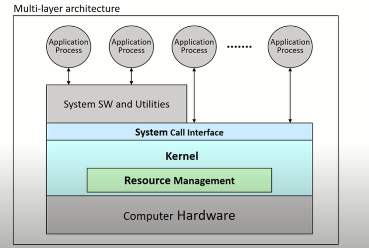

### 1. 운영체제의 역할

- User Interface(편리성) : 사용자가 시스템을 편리할 수 있도록 제공
  - CUI (문자기반, Character user interface)
  - GUI (Graphical User interface)
  - EUCI (End-User Comfortable Interface)

- Resource management(효율성) : 주어진 자원을 잘 활용해서 서비스를 제공
  - HW resource
  - SW resource
- Process (실행주체) and Thread management
- System management(시스템 보호)

### 2. 컴퓨터 시스템의 구성

- 하드웨어 => os => application
- OS : 하드웨어를 관리하면서 사용자에게 서비스별 제공하는 역할
- Kernel : 운영체제 핵심을 모아둔 곳
- System Call Interface : 우리가 필요한 기능을 요청하는 통로 , 커털이 제공하는 기능들 중에서 그 사용자가 사용할 수 있는 기능들을 모아둔 곳 ( 사용자가 커널을 직접 억세스하면 문제가 발생, 커널을 마음대로 조작해 버리면 os가 하드웨어를 제어하는데 문제를 일으킬 수 있다. 직접 조작하면 안된다. ) 

### 3. 운영체제의 구분

#### 3.1동시 사용자 수

- 단일 사용자 (Single-user system)
  - 한 명의 사용자만 시스템 사용 가능
    - 한명의 사용자가 모든 시스템 자원 독점
    - 자원관리 및 시스템 보호 방식이 간단 함
  - 개인용 장비(PC, mobile)등에 사용
    - Windows 7/10, android, MS-DOS등
- 다중 사용자 (Multi-user system)
  - 동시에 여러 사용자들이 시스템 사용
    - 각종 시스템 자원(파일 등)들에 대한 소유 권한 관리 필요
    - 기본적으로 Multi-tasking 기능 필요
    - os의 기능 및 구조가 복잡
  - 서버, 클러스터 장비 등에 사용
    - Unix, Linux, Windows server 등

#### 3.2 동시 실행 프로세스 수

- 단일작업 (Single-tasking system) 
  - 시스템 내의 하나의 작업(프로세스)만 존재
    - 하나의 프로그램 실행을 마친 뒤에 다른 프로그램의 실행
  - 운영체제의 구조가 간단
  - EX) MS-DOS
- 다중작업 (Multi-tasking system(Multiprogramming system)) 
  - 동시에 여러 작업(프로세스)의 수행 가능
    - 작업들 사이의 동시 수행, 동기화 등을 관리해야 함
  - 운영체제의 기능 및 구조가 복잡
  - EX) Unix/Linux, Windows 등