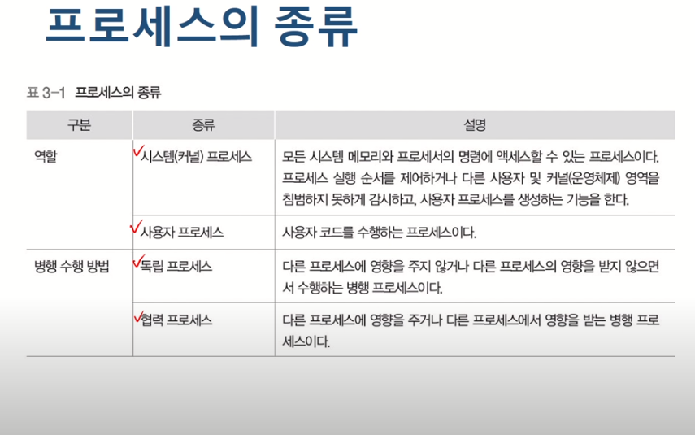
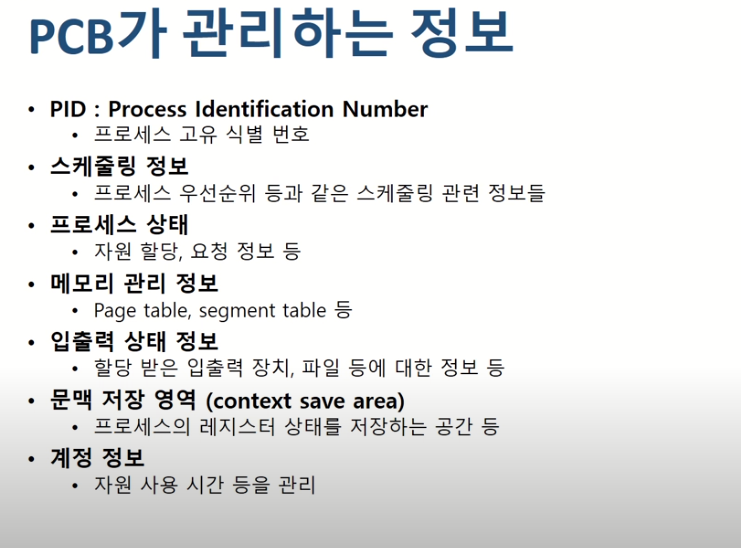
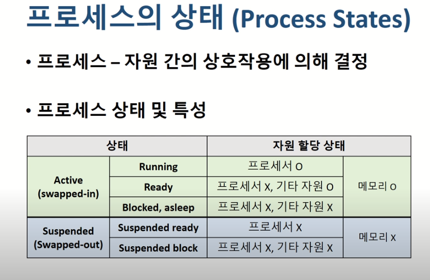
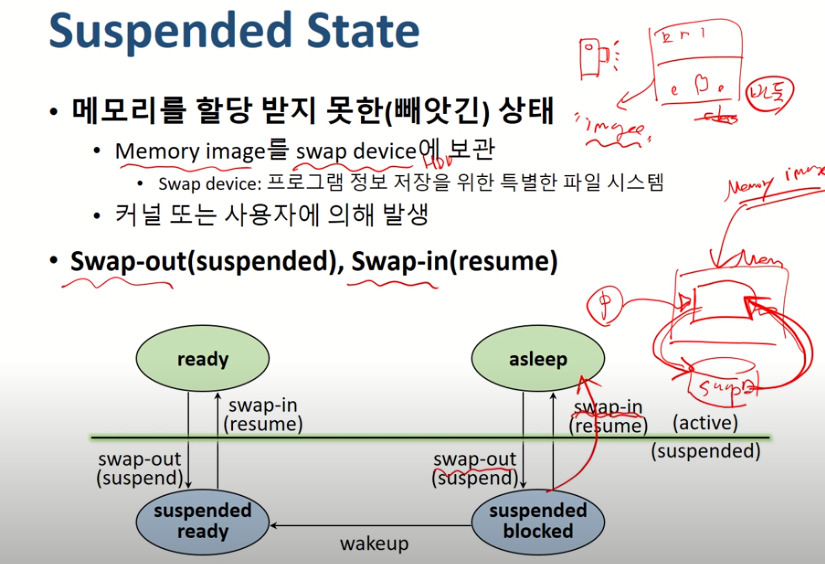

### 운영체제

#### 프로세스 관리

JOB vs Process

- 작업
  - 실행 할 프로그램 + 데이터
  - 컴퓨터 시스템에 실행 요청 전의 상태
- 프로세스
  - 실행을 위해 시스템(커널)에 등록된 작업 
  - 시스템 성능 향상을 위해 커널에 의해 관리됨
  - `커널에 등록되는 이유는 시스템의 성능을 향상 시키기 위해서`

- 프로세스의 정의
  - 실행중인 프로그램
  - 커널에 등록되고 커널의 관리하에 있는 작업
  - 각종 자원들으르 요청하고 할당 받을 수 있는 개체
  - 프로세스 관리 블록을 할당받은 개체
  - 능동적인 개체 (실행 중에 각종 자원을 요구, 할당 , 반납 하며 진행)

##### 자원의 개념

- 커널의 관리 하에 프로세스에게 할당/반납 되는 수동적 개체
  - 할당/반납의 관리는 "커널"이 한다.
- 자원의 분류
  - 하드웨어 자원
  - 소프트웨어 자원 : 메세지 , 시그널 ,파일 등

##### Process Control Block(PCB)

- 프로세스를 컨트롤하기 위해 필요한 정보들을 모아 놓은 블록
- OS가 프로세스 관리에 필요한 정보 저장
- 프로세스 생성 시, 생성됨

- 우리의 메모리는 커널이 사용하는 영역과 일반영역으로 구분되는데, PCB는 커널이 사용하는 영역에서 활용됨

- PCB 정보는 OS별로 서로 다름
- PCB 참조 및 갱신 속도는 OS의 성능을 결정 짓는 중요한 요소 중 하나

##### Created State

- Job을 커널에 등록
- PCB 할당 및 프로세스 생성
- 가상메모리 공간을 체크해서 메모리 공간이 있다면 : ready  없다면 :suspended ready

##### Ready State

- 프로세서 외에 다른 모든 자원을 할당 받은 상태 
  - 프로세서 할당 대기 상태
  - 즉시 실행 가능 상태
- Dispatch(or Schedule)
  - Ready State -> Running State (Cpu할당)

##### Running State

- 프로세서와 필요한 자원을 모두 할당 받은 상태
- Preemption
  - running state -> ready state
  - 프로세서 스케줄링
- Block/Sleep
  - Running State -> asleep state
  - I/O등 자원 할당 요청

##### Blocked/Asleep State

- 프로세서 외에 다른 자원을 기다리는 상태
  - 자원 할당은 system call에 의해서만 이루어짐
- Wake-up
  - Asleep State -> ready State

##### Suspended State

- 메모리를 할당 받지 못한(빼앗긴 상태)
  - memory image를 swap device에 보관
    - swap device : 프로그램 정보 저장을 위한 특별한 파일 시스템
  - 커널 또는 사용자에 의해 발생
- swap-out(suspended) , swap-in(resume)

##### Terminated / Zombie State

- 프로세스 수행이 끝난 상태
- 모든 자원 반납 후,
- 커널 내에 일부 PCB정보만 남아 있는 상태
  - 이후 프로세스 관리를 위해 정보 수집

