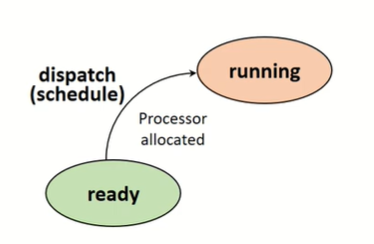
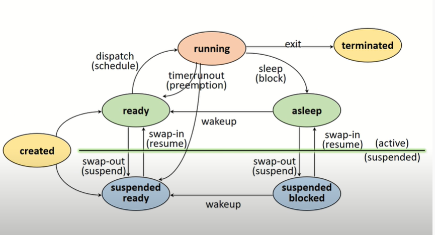

# 프로세스 관리

### 1. 프로세스 정의

#### 1.1 실행중인 프로그램

- 커널에 등록되고 커널의 관리하에 있는 작업
- 각종 자원들을 요청하고 할당 받을 수 있는 개체
- 프로세스 관리 블록(PCB)을 할당 받은 개체
- 능동적인 개체(실행 중에 각종 자원을 요구, 할당, 반납하며 진행)

### 2. 자원(Resource)의 개념

- 커널의 관리 하에 프로세스에게 할당/반납 되는 수동적 개체
- 자원의 분류
  - H/W resources (Processor, memory, disk, monitor 등)
  - S/W resources (Message, signal, files 등)

### 3. PCB (Process Control Block) 

- OS가 프로세스 관리에 필요한 정보 저장
- 프로세스 생성 시, 생성 됨
- PCB는 커널이 관리하는 영역에 저장된다.

- PCB가 관리하는 정보는 OS별로 서로 다름, PCB 참조 및 갱신 속도는 OS의 성능을 결정 짓는 중요한 요소 중 하나

### 4. 프로세스의 상태(Process States)

#### 4.1 Created State (생성된 상태)

- 작업(Job)을 커널에 등록

- PCB 할당 및 프로세스 생성

- 커널
  - 가용 메모리 공간 체크 및 프로세스 상태 전이
  - 쓸 수 있는 메모리가 있으면 ready 상태 없으면 suspende ready
  
  
  
  

#### 4.2 Ready State

- 프로세서 외에 다른 모든 자원을 할당 받은 상태
  - 프로세서(CPU) 할당 대기 상태
  - (CPU만 있으면) 즉시 실행 가능 상태
  
- Dispatch (or Schedule)
  - Ready state => running state
  - CPU를 할당 받으면 running상태가 되는 것
  
  
  
  

#### 4.3 Running State

- 프로세서와 필요한 자원을 모두 할당 받은 상태(열심히 작업을 실행하는 상태)

-  Preemption
  - Running state => ready state(프로세서만 없는 상태)
  - 프로세서 스케줄링 (e. time-out, priority changes)에 따라서 변이가 올때 
  
- Block/sleep
  - Running state => asleep state (I/O를 기다리고 있는 상태)
  - I/O 등 자원 할당 요청  

  

- Blocked / Asllep State

  - 프로세서 외에 다른 자원을 기다리는 상태
  - Wake - up (Asleep state => ready state)

  

  

#### 4.4 Suspended State

- 메모리를 할당 받지 못한(빼앗긴) 상태

  - Memory image를 swap device에 보관

    *swap device : 프로그램 정보 저장을 위한 특별한 파일 시스템

  - 커널 또는 사용자에 의해 발생

- Swap-out(suspended) : 메모리를 뺐기면서 Swap divice에 저장

- Swap-in(resume) :  메모리를 복구

#### 4.5 Terminated / Zombie State

- 프로세스 수행이 끝난 상태
- 모든 자원 반납 후,
- 커널 내에 일부 PCB 정보만 남아 있는 상태
  - 이후 프로세스 관리를 위해 정보 수집

### 5. 프로세스의 상태 (Process State)

- 프로세스 - 자원 간의 상호작용에 의해 결정
- 프로세스 상태 및 특성

